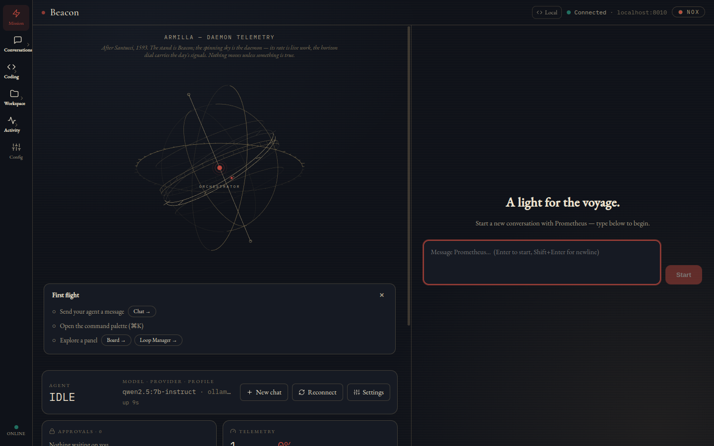
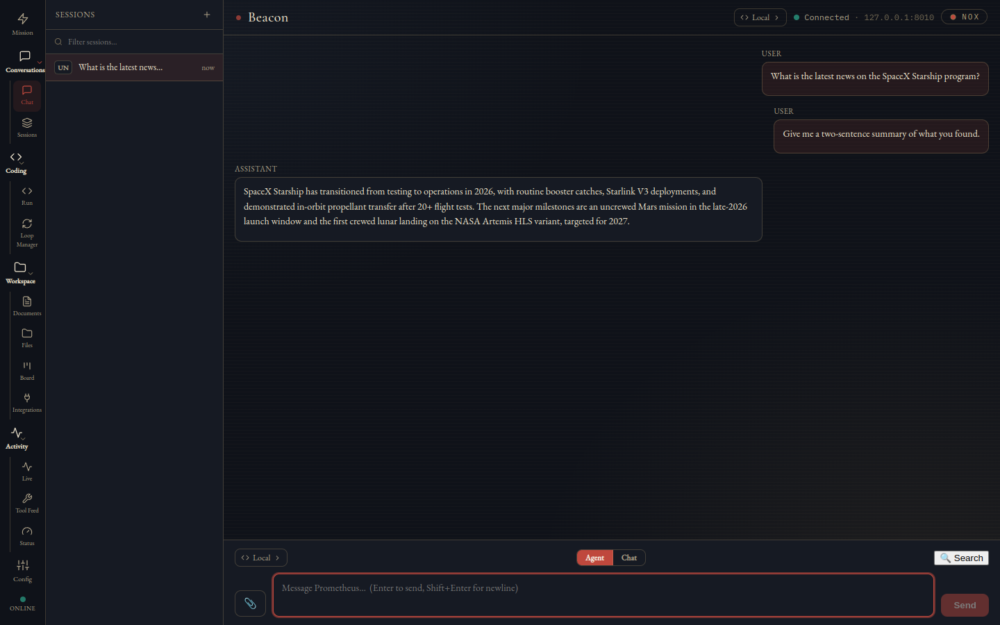
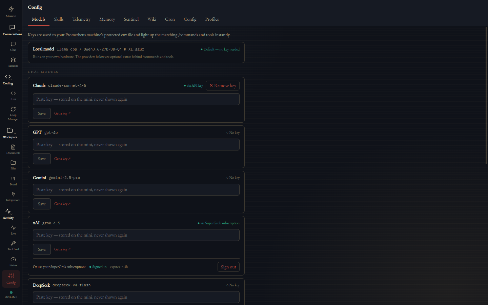
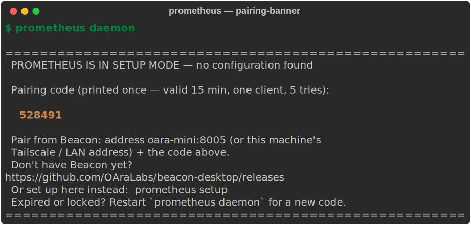
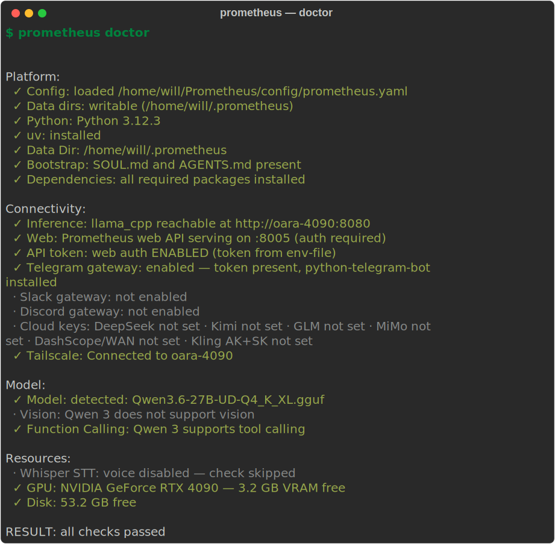
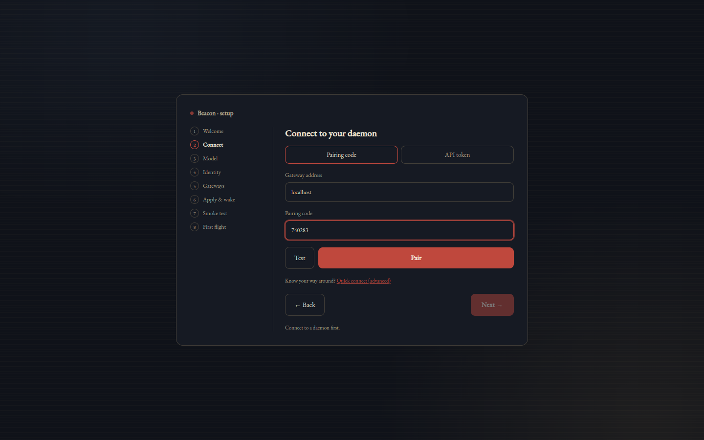

# Prometheus

A sovereign agent harness for local LLMs — the validation layer that makes open models actually reliable in a tool loop.

**The model is the agent. The harness is the vehicle.**



Prometheus is two pieces that pair with a 6-digit code:

- **The daemon** — an always-on Python agent runtime: agent loop + Model Adapter Layer, three chat gateways (Telegram / Slack / Discord), lossless memory, sandboxed coding runs, cron, a security gate, and a bearer-token REST + WebSocket control plane.
- **[Beacon](https://github.com/OAraLabs/beacon-desktop)** — its native desktop cockpit (macOS / Linux): chat with live tool timelines, Mission Control, a Loop Manager for coding runs, a documents editor with AI redlines, Kanban, telemetry feeds, and per-provider key management.

```bash
git clone https://github.com/OAraLabs/Prometheus.git && cd Prometheus
pip install -e '.[full]'
prometheus setup          # auto-detects llama.cpp / Ollama / LM Studio / vLLM
prometheus                # chat in the CLI
prometheus daemon         # always-on: web API + gateways + cron + background layer
```

`prometheus setup` probes for a running local inference server, generates your agent's identity, writes a working config with the web API enabled, and smoke-tests the loop. In a hurry? `prometheus setup --fast` (or `--noninteractive`) is the three-question version. On first daemon start a web API token is minted and printed once — `prometheus token show` re-prints it. If anything misbehaves: `prometheus doctor`.

> `pip install 'oara-prometheus[full]'` is the packaged path — CI builds sdist + wheel per tagged release; PyPI publishing lands once the release pipeline is public. Until then, the git checkout above is the path that works for everyone.

**What it gives you:**

- **Reliable tool calls on open models** — a Model Adapter Layer validates every call, auto-repairs common errors (fuzzy names, JSON inside markdown fences, type coercion), and enforces output schemas at the token level via GBNF for llama.cpp.
- **Always-on gateways** — Telegram, Slack, and Discord at parity (one shared command layer), with mid-turn `/steer` and `/queue` for durability while the agent is mid-task.
- **Visible memory that rides every prompt** — `MEMORY.md` and `USER.md` you can read, structured facts mined from conversations every 30 minutes, and passive recall that FTS-matches each message against the memory store and injects what's relevant.
- **Lossless context** — DAG-based compression with full-text search so long sessions don't drop facts; originals are always recoverable.
- **Sandboxed coding runs** — point it at a repo and an acceptance command; it iterates to green in a clone and hands you a reviewable branch. Never merges, never pushes.
- **A desktop cockpit** — Beacon pairs to the daemon over your LAN or tailnet and gives every subsystem a native surface.

> **Status:** Active development. Expect rough edges. Fixes land weekly. Feedback welcome.

**Deeper docs** — the guide pages under [`docs/guide/`](docs/guide/):
[Install & first flight](docs/guide/install.md) · [Feature reference](docs/guide/features.md) · [Beacon desktop](docs/guide/beacon.md) · [Coding Mode & Loop Manager](docs/guide/coding-mode.md) · [Memory & knowledge](docs/guide/memory.md) · [Models & providers](docs/guide/providers.md) · [HTTP & WebSocket API](docs/guide/api.md)

---

## Prior art and influences

**Not a fork, and not a port.** Prometheus is an original Python codebase. Several of its subsystems were designed by studying the *architecture and behavior* of proven open-source projects, then reimplementing those ideas from scratch — no source code was copied or translated. The table credits the prior art that shaped each subsystem's design:

| Subsystem | Influence | What the design drew on |
|-----------|-----------|-------------------------|
| Agent loop | Claude Code patterns (via Sigrid Jin's clean-room analysis) | The tool-registry / hook-pipeline / permission-governance shape |
| Always-on gateway | Hermes | The always-on messaging + cron + credential-rotation model |
| Context management | Lossless-Claw / OpenClaw | The DAG-based lossless-compression-with-FTS approach |
| Production patterns | OpenClaw | Memory-extractor / archive-bridge / heartbeat patterns |
| Knowledge base | Karpathy's LLM Wiki (concept) | Memory extraction → wiki pages → cross-referenced knowledge |

Where a subsystem's design was shaped by external prior art, the relevant source file credits that influence in a header comment. The implementation is Prometheus's own.

## What we built from scratch

Three subsystems had no meaningful prior art and are wholly original:

- **Model Adapter Layer** — the gap between Claude-quality tool-calling and what open models actually produce. Validates, auto-repairs, enforces output schemas, retries with specific error context.
- **SENTINEL** — a proactive layer that watches for idle time and acts, instead of only reacting to prompts. Nudges, dreams, synthesizes.
- **Wiki Knowledge System** — turns every conversation into a compounding knowledge base that cross-references itself over time.

These are where most of the interesting work lives.

---

## The Problem Nobody Else Solves

Open models are getting good at conversation. They're still terrible at *doing things*. Ask Qwen to call a tool and it hallucinates the tool name. Ask Gemma to return JSON and it wraps it in markdown. Ask Llama to chain three tool calls and it drops a required parameter on the second one.

Every other agent harness — LangChain, CrewAI, AutoGen — assumes the model will get tool calls right. That works fine when you're paying OpenAI. It falls apart the moment you point it at a local model.

Prometheus fixes this with a Model Adapter Layer that sits between your agent loop and whatever LLM you're running. Every tool call gets validated before execution, common errors get auto-repaired (fuzzy name matching, JSON extraction from markdown fences, type coercion), and when something still fails, the model gets specific error feedback with the actual schema — not a generic "try again." For llama.cpp, it goes further: GBNF grammar constraints force valid JSON at the token level, so the model literally can't produce malformed output.

The result: open models that reliably call tools, chain multi-step tasks, and run autonomously — without you babysitting every interaction.



## What Makes This Different

Prometheus isn't a wrapper around `ollama.chat()`. It's a complete agent operating system with novel systems that don't exist in other harnesses:

**The Model Adapter Layer is the core innovation.** Four cascading extraction strategies handle whatever mess the model produces. A retry engine feeds specific schema errors back to the model. GBNF grammar enforcement at the llama.cpp level makes invalid JSON structurally impossible. Telemetry tracks success rates per model per tool so you know exactly where your model struggles. Nothing else does this — other harnesses either assume clean output or crash.

**Lossless Context Management means your agent never forgets.** Every message is persisted to SQLite. When context fills up, a two-tier compression system kicks in: Tier 1 strips `tool_result` content from old messages (free — the output was already acted on). Tier 2 uses LLM-powered batch summarization when pruning alone isn't enough. But the originals are always recoverable — old messages get summarized into a DAG structure, and the agent can expand any summary back to full detail on demand. Full-text search across your entire conversation history. And memory isn't just storage: extracted facts ride back into each turn via passive recall, matched against what you just said.

**SENTINEL transforms the agent from reactive to proactive.** Most agents sit idle until you talk to them. Prometheus has a background intelligence layer that watches tool performance patterns, consolidates memory, lints its own knowledge base, and discovers cross-entity insights — all while you're away. Three of four phases use zero LLM calls. The fourth is budget-capped at 2,000 tokens. It nudges you via Telegram when it finds something interesting but never acts without permission.

**A compounding knowledge base inspired by Karpathy's LLM Wiki concept.** Every 30 minutes, a Memory Extractor pulls structured facts from your conversations. A WikiCompiler builds entity pages with cross-references. The wiki grows and connects itself over time. Point Obsidian at the markdown files and the graph view lights up.

**Infrastructure self-awareness via the AnatomyScanner.** At startup, Prometheus scans your hardware (CPU, RAM, GPU VRAM), detects the loaded model and its quantization, maps your Tailscale network peers, checks disk usage, and generates `ANATOMY.md` with Mermaid architecture diagrams of your entire setup. The agent knows exactly what machine it's running on, what model is loaded, and what resources are available.

**An evaluation framework with a local LLM judge.** Most agent evals require API calls to GPT-4. Prometheus uses constrained-decoding on your local model to judge task completion, tool usage accuracy, and hallucination — zero API cost. Failure classification (model vs harness vs unclear) and trend tracking across models and runs.

**LSP integration for compiler-grade code intelligence.** Instead of grepping for function names, the agent queries language servers for real symbol definitions, type errors, and references. After every file edit, a diagnostics hook automatically checks for type errors and feeds them back to the model in the same turn.

## Open Models First, APIs Welcome

Prometheus is built for local inference. That's the whole point — sovereignty, privacy, no subscriptions. But it's not religious about it. If you want to use cloud models, the same harness works with:

- OpenAI (GPT-4o, o3-mini)
- Anthropic (Claude)
- Google Gemini (Flash, Pro)
- xAI (Grok) — via API key **or** by signing in with a SuperGrok subscription (OAuth device flow; no key needed)
- DeepSeek, Kimi (Moonshot), GLM (Z.ai), MiMo (Xiaomi)
- Any OpenAI-compatible endpoint (vLLM, LiteLLM, Together, etc.)

Switch any single chat with a slash command — `/claude`, `/gpt`, `/gemini`, `/xai`, `/deepseek`, `/kimi`, `/glm`, `/mimo` — and `/local` to come home. Keys are managed from Beacon's Models tab (paste once, live immediately, no restart) or the env file. The adapter layer adjusts its strictness automatically: full validation for open models, passthrough for APIs that already handle tool calling well.



The architecture doesn't care where the tokens come from. It cares that the tools get called correctly.

## Features

*The [feature reference](docs/guide/features.md) covers everything below in depth — including which subsystems are on by default and which are opt-in.*

### Model Independence

- Runs any model llama.cpp or Ollama can serve — Qwen, Gemma, Llama, Mistral, Phi, DeepSeek, Command-R
- Optimized formatters for Qwen and Gemma, default formatter works with everything else
- Auto-detects whatever model is loaded — swap the GGUF, restart, done
- 10+ providers: llama.cpp, Ollama, OpenAI-compatible (OpenAI/Gemini/xAI/DeepSeek/Kimi/GLM/MiMo), Anthropic
- Configurable adapter strictness: STRICT (small models), MEDIUM (Qwen/Gemma), NONE (cloud APIs)
- Per-session model override via slash command, REST, or Beacon's model switcher

### 40+ Builtin Tools

`bash`, `read_file`, `write_file`, `edit_file`, `grep`, `glob`, `web_search`, `web_fetch`, `youtube_transcript`, `download_file`, `browser` (Playwright), `image_generate`, `video_generate`, `tts`, `message`, `dashboard`, `notebook_edit`, `cron_create/delete/list`, `task_create/get/list/update/stop/output`, `todo_write`, `skill`, `agent` (subagent spawning), `ask_user`, `sessions_list/send/spawn`, `lcm_grep/expand/describe/expand_query`, `wiki_compile/query/lint`, `sentinel_status`, `audit_query`, `anatomy`, `lsp` (7 actions), plus dynamic MCP tools (`mcp__{server}__{tool}`).

### Coding Mode — iterate to green

Point the agent at a repo, a task, and an acceptance command. It clones the repo into a sandbox (cwd jail, env-scrubbed so your provider keys never reach the subprocess), works in rounds until the acceptance command exits 0, and leaves a reviewable branch. **"Done" is a verdict, not a claim** — the session re-runs your acceptance command itself and rejects no-evidence turns. Mid-run supervision (pause / inject / resume) rides a control channel the run polls between episodes. Rounds stream live to Beacon.


Beacon's **Loop Manager** turns this into a PM cockpit: register repos, keep a `TASKS.md` board, edit the `LOOP.md` run contract, and fire — Autonomous, Composed, or Supervised. Kanban stories can be dispatched straight into coding runs. See the [Coding Mode guide](docs/guide/coding-mode.md).

### Skills

The agent writes skills for itself: the SkillCreator turns successful multi-step traces into markdown skill files, the SkillRefiner updates them when better executions come along, and a weekly Curator pass consolidates and prunes (pinned skills are protected; nothing is hard-deleted). Three core skills ship in the package (`commit`, `debug`, `plan`), and the repo carries a **102-file skill library** in [`skills/`](skills/) you can drop into `~/.prometheus/skills/` selectively — it's deliberately not auto-loaded, to keep prompts lean. GEPA (evolutionary skill optimization, judged by your local model) is available as an opt-in idle-time layer.

### MCP Integration

- Dynamic tool discovery from any MCP server
- Collision-free naming (`mcp__{server}__{tool}`), Stdio/HTTP/SSE transport, config fingerprinting
- Context7 ships ready for up-to-date library documentation

### Identity System

- **SOUL.md** — persistent identity loaded into every prompt. Survives `/reset`. Generated at setup — no hardcoded names.
- **AGENTS.md** — agent registry with specializations for subagent spawning
- **ANATOMY.md** — live infrastructure snapshot with Mermaid diagrams (hardware, VRAM, model + quant, Tailscale peers), queryable via the `anatomy` tool
- **MEMORY.md + USER.md** — the agent learns who you are over time (bounded: 12K + 8K chars)
- **Agent Profiles** — `full`, `coder`, `research`, `assistant`, `minimal` via `/profile` to trade tool breadth for context budget

### Security

- 4-level trust model (BLOCKED → APPROVE → AUTO → AUTONOMOUS), origin-aware: background work (SENTINEL, cron, gym) faces stricter gates than what you ask for directly
- 33+ always-blocked patterns, workspace boundary enforcement, bash intent analysis
- Audit logging (SQLite + JSONL, queryable via `/audit`), exfiltration detection, prompt-injection defense
- Approval queue — `/approve`, `/deny`, `/pending` via Telegram, or one-click Approve/Deny cards in Beacon
- Authenticated control plane — bearer-token REST plus first-frame token auth on the WebSocket bridge
- Secrets live in `~/.config/prometheus/env`, never in the yaml; a pre-commit hook blocks secrets and network identifiers from ever landing in the repo

### Always-On

- Telegram gateway with photo (vision captioning), voice (Whisper STT), document (20+ formats), and sticker handling
- Slack gateway (Socket Mode) at Telegram parity: 23 slash commands, thread-based long replies, channel whitelists
- Discord gateway at the same parity: `/prometheus` app commands, DM + guild/channel whitelists
- Cron scheduler (natural-language scheduling supported), heartbeat monitoring, systemd service
- Durable background tasks (`tasks.db` survives restarts) with an honesty check: "I'll let you know when it's done" must be backed by a real registered task
- 40+ slash commands on Telegram — including mid-turn `/steer`, `/queue`, and per-chat provider overrides

### Documents & Board

- **Documents editor** — a confined documents folder served over the API; Beacon gives it a calm writing surface with auto-save and **Ask AI redlines**: describe a change, get `{find, replace, reason}` edits as inline tracked-changes, accept or reject each one. Nothing touches disk until you accept.
- **Kanban board** — projects and stories over REST, drag-and-drop in Beacon, and stories dispatchable into coding runs.

### Image & Video Generation

- `image_generate`: Pollinations (free, hosted), ComfyUI (free, local GPU), or WAN 2.5 via DashScope (paid). `auto` never selects the paid backend.
- `video_generate`: Kling 3.0 text/image-to-video (paid, dormant until keyed).
- Details in the [providers guide](docs/guide/providers.md).

### Fine-Tuning Flywheel (in progress)

- Successful tool-call traces and adapter repair-pairs are captured, stored, and mined into an exportable dataset (capture → store → miner → export); browse with `/pairs`
- A gym runs frozen task-sets against live models with deterministic **dual scoring** (raw emission vs post-repair execution) and refuses to declare winners below sample-size thresholds
- This is the data-collection half of a LoRA loop for the local model; the training step itself is still on the roadmap

### Observability

- Tool-call telemetry (SQLite) — success rates per model per tool, surfaced in Beacon's Tool Feed and `/health`
- Every model call wrapped in an `LLMCallEnvelope` — per-round token accounting, silent failures surfaced
- Phoenix/OpenTelemetry tracing — env-gated, zero-cost no-ops when off
- Failure classification in evals (model vs harness vs unclear) with trend tracking

### On by default vs opt-in

Chat, tools, adapter, memory + LCM + passive recall, security gate, telemetry, and the web API are on out of the box. The bigger autonomous subsystems — SENTINEL dreaming, the model router, LSP, GEPA, escalation-to-teacher, Symbiote (experimental self-modification with blue-green deploy + auto-rollback) — ship **off by default** and are one config flag away when you want them. The [feature reference](docs/guide/features.md) marks every subsystem's default.

## Quick Start

### Prerequisites

- Python 3.11+
- llama.cpp or Ollama running with any model loaded (or a cloud API key)
- A Telegram bot token (from @BotFather) — optional, CLI works without it

### Install

```bash
git clone https://github.com/OAraLabs/Prometheus.git && cd Prometheus
pip install -e '.[full]'
prometheus setup
```

The setup wizard generates your personalized identity, detects your inference server (llama.cpp:8080, Ollama:11434, LM Studio:1234, vLLM:8000), writes the config with the web API **enabled**, and runs a smoke test. No server running? The wizard offers a remote URL, a cloud provider, or copy-paste install instructions — it never writes a config it knows is broken.

Variants:

```bash
prometheus setup --fast            # quick path: probe → yaml → env, 3 questions
prometheus setup --noninteractive  # zero questions (first detected server, CLI gateway)
prometheus setup --gateway-only    # add/change Telegram, Slack, or Discord later
```

Prefer doing setup from a couch? Skip `prometheus setup`, run `prometheus daemon` bare, and it boots in **setup mode** — a pairing-only API that prints a one-time 6-digit code. Beacon's wizard takes it from there (detects backends, names the agent, configures gateways) and the daemon wakes fully configured:



### Run

```bash
prometheus                                        # interactive CLI
prometheus --once "List the Python files here"    # one-shot
prometheus daemon                                 # always-on
```

On the first daemon start, Prometheus mints a secure `PROMETHEUS_API_TOKEN`, saves it to `~/.config/prometheus/env`, and prints it **once**:

```bash
prometheus token show     # re-print the token
prometheus token rotate   # invalidate + mint a new one
curl -H "Authorization: Bearer $(prometheus token show | head -1)" http://localhost:8005/api/status
```

### Run as a systemd service (Linux)

```bash
prometheus install-service          # writes ~/.config/systemd/user/prometheus.service
systemctl --user start prometheus
journalctl --user -u prometheus -f
```

### When something is off

```bash
prometheus doctor
```



Exit code is nonzero when anything is broken, so it also works in scripts.

### Get Beacon

Grab the desktop app from [beacon-desktop releases](https://github.com/OAraLabs/beacon-desktop/releases) (macOS dmg, Linux AppImage/deb) or build from source (`npm install && npm run dev`). First launch walks you through pairing — the full flow with screenshots is in the [install guide](docs/guide/install.md), and the app tour is in the [Beacon guide](docs/guide/beacon.md).



### Where the config lives (search order)

1. an explicit `--config` path
2. `config/prometheus.yaml` — repo-local (checkout installs; gitignored)
3. `$PROMETHEUS_CONFIG_DIR/prometheus.yaml` — default `~/.prometheus/prometheus.yaml`

Secrets never go in the yaml — they live in the env file `~/.config/prometheus/env`, which both `prometheus daemon` and the systemd unit load.

### Multi-Machine Setup

Run the agent on one machine, point it at a GPU machine for inference:

```yaml
model:
  provider: "llama_cpp"
  base_url: "http://gpu-machine:8080"
  fallback:
    - provider: "ollama"
      base_url: "http://gpu-machine:11434"
    - provider: "anthropic"
      api_key_env: "ANTHROPIC_API_KEY"
      model: "claude-haiku-4-5-20251001"
```

Connect via Tailscale, WireGuard, or any network — Beacon pairs over the same address. Prometheus talks HTTP; localhost or remote, it doesn't care.

### What About Smaller GPUs?

16GB VRAM runs Gemma 2 9B or Qwen 2.5 14B (Q4 quantized). Set `strictness: STRICT` — the adapter compensates with more validation and retries. No GPU at all? Use a cloud provider and you still get the full harness: memory, wiki, SENTINEL, security, profiles, all of it.

## Architecture

```
┌──────────────────────────────────────────────────────────┐
│                    INTERFACE LAYER                        │
│  Telegram │ Slack │ Discord │ CLI │ Beacon desktop        │
│           (REST :8005 + WebSocket :8010, token-authed)    │
└────────────────────────┬─────────────────────────────────┘
                         │
┌────────────────────────┴─────────────────────────────────┐
│                  ALWAYS-ON LAYER                          │
│  Heartbeat │ Cron │ SENTINEL │ Memory Extractor │ Tasks   │
└────────────────────────┬─────────────────────────────────┘
                         │
┌────────────────────────┴─────────────────────────────────┐
│                 ORCHESTRATION LAYER                       │
│  Agent Loop → Model Adapter → Tool Dispatch               │
│  ┌──────────────────────────────────────────────────┐     │
│  │  MODEL ADAPTER LAYER                             │     │
│  │  Validator │ Formatter │ Enforcer │ Retry │ Telem │     │
│  └──────────────────────────────────────────────────┘     │
│  Model Router │ Coding Mode │ LSP │ MCP │ Subagents       │
└────────────────────────┬─────────────────────────────────┘
                         │
┌────────────────────────┴─────────────────────────────────┐
│               IDENTITY & KNOWLEDGE LAYER                  │
│  SOUL.md │ AGENTS.md │ ANATOMY.md │ Profiles              │
│  LCM (DAG compression) │ Wiki │ MEMORY.md │ Passive recall│
└────────────────────────┬─────────────────────────────────┘
                         │
┌────────────────────────┴─────────────────────────────────┐
│                 MODEL PROVIDER LAYER                      │
│  llama.cpp │ Ollama │ OpenAI │ Anthropic │ Gemini │ xAI   │
│  DeepSeek │ Kimi (Moonshot) │ GLM (Z.ai) │ MiMo (Xiaomi)  │
│  (xAI: API key or SuperGrok subscription OAuth)           │
└──────────────────────────────────────────────────────────┘
```

## Configuration

```yaml
model:
  provider: "llama_cpp"              # or ollama, openai, anthropic, gemini, xai,
                                     #    deepseek, kimi, glm, mimo
  base_url: "http://localhost:8080"
  # model auto-detected from llama.cpp on startup

context:
  effective_limit: 24000
  compression_trigger: 0.75

security:
  permission_mode: "default"
  workspace_root: "~/.prometheus/workspace"

gateway:
  telegram_enabled: true
  # token via env: PROMETHEUS_TELEGRAM_TOKEN

memory:
  recall:
    enabled: true      # passive recall — stored facts ride each turn

sentinel:
  enabled: false       # opt-in: idle-time dreaming, wiki lint, synthesis
  dream_budget_tokens: 2000

profile:
  active: "full"       # full | coder | research | assistant | minimal
```

## Gateways

Three messaging gateways, all first-class: every onboarding surface (`prometheus setup`, the fast path, the remote setup API, and Beacon's wizard) can enable any subset, and `prometheus doctor` reports each one's state.

| Gateway | What you need | Env vars | Extra |
|---------|---------------|----------|-------|
| **Telegram** | A bot token from [@BotFather](https://t.me/BotFather) (`/newbot`) | `PROMETHEUS_TELEGRAM_TOKEN` | built-in |
| **Slack** | A Slack app ([api.slack.com/apps](https://api.slack.com/apps)) with Socket Mode — **both** tokens: bot (`xoxb-…`) + app-level (`xapp-…`) | `PROMETHEUS_SLACK_BOT_TOKEN`, `PROMETHEUS_SLACK_APP_TOKEN` | `pip install 'oara-prometheus[slack]'` |
| **Discord** | A bot from the [developer portal](https://discord.com/developers/applications) with **Message Content Intent**, invited with `bot` + `applications.commands` scopes | `PROMETHEUS_DISCORD_TOKEN` | `pip install 'oara-prometheus[discord]'` |

Tokens live in the env file, never in the yaml. The easiest way to configure any of them is `prometheus setup --gateway-only`.

## Commands

The full 40+ command surface is in the [feature reference](docs/guide/features.md#commands); the daily drivers:

| Command | Description |
|---------|-------------|
| `/status` `/health` `/context` | Model, uptime, subsystem health, token budget |
| `/steer` | Inject a mid-turn course-correction while the agent is working |
| `/queue` `/unqueue` | Line up follow-up messages while it's busy |
| `/wiki` `/note` `/memory` | Knowledge base stats, quick capture, memory files |
| `/skills` `/profile` `/anatomy` | Skills, agent profiles, infrastructure snapshot |
| `/approve` `/deny` `/pending` | Human-in-the-loop approval queue |
| `/claude` `/gpt` `/gemini` `/xai` `/deepseek` `/kimi` `/glm` `/mimo` | Per-chat cloud override |
| `/local` `/route` | Back to the local model · show this chat's routing |
| `/sentinel` `/gepa` `/curator` `/symbiote` `/audit` | The opt-in autonomous layers |

Cloud slash-commands are configurable per command (provider, key env, model) in `prometheus.yaml` — see the [providers guide](docs/guide/providers.md).

## Benchmarks

```bash
python -m prometheus.benchmarks.runner --model gemma4-26b --tier 1
```

Latest results (Gemma 4 26B, RTX 4090):

```
Tasks: 19  |  OK: 19  |  Errors: 0
Avg latency: 1.4s  |  Total: 27s

Tool Usage      : 97.4%
Task Completion : 100%
No Hallucination: 84.7%
```

All evaluation runs locally — the LLM judge uses constrained decoding on your own hardware.

## Project Structure

```
prometheus/
├── src/prometheus/
│   ├── engine/          # Agent loop, sessions, streaming, honesty check
│   ├── adapter/         # Model Adapter Layer (validator, formatter, enforcer, retry)
│   ├── providers/       # llama_cpp, ollama, openai_compat, anthropic, xai_oauth, registry
│   ├── tools/builtin/   # 40+ builtin tools
│   ├── coding/          # Sandboxed iterate-to-green runs + supervision + livestream
│   ├── hooks/           # PreToolUse / PostToolUse + hot reload + LSP diagnostics
│   ├── permissions/     # Security gate + audit + exfiltration + approval queue
│   ├── memory/          # LCM engine, wiki compiler, extractor, passive recall
│   ├── context/         # Token budget, compression, prompt assembly
│   ├── gateway/         # Telegram, Slack, Discord, cron, heartbeat
│   ├── web/             # REST API, WebSocket bridge, setup-mode server
│   ├── documents/       # Confined documents service + AI redline suggestions
│   ├── kanban/          # Projects + stories store
│   ├── sentinel/        # Observer, AutoDream, wiki lint, consolidation, digest
│   ├── mcp/  lsp/       # MCP runtime · language-server client
│   ├── evals/  gym/     # Local-judge evals · fine-tuning gym (dual scoring)
│   ├── coordinator/     # Subagent spawning, divergence detection
│   ├── learning/        # Skill creator/refiner, curator, GEPA, pair capture
│   ├── symbiote/        # Experimental self-modification (off by default)
│   ├── infra/           # AnatomyScanner, project configs
│   ├── telemetry/       # Tool-call tracking + cost
│   └── config/          # Settings, paths, env overrides, profiles
├── templates/           # Identity templates (no personal data)
├── skills/              # 102-file skill library (.md, opt-in)
├── tests/               # 3,400+ tests across 201 files
├── docs/                # Guides, architecture, sprint reports
│   └── guide/           # Install · features · Beacon · coding · memory · providers · API
├── gym/                 # Frozen task-sets, harvest corpus
├── packaging/           # systemd unit
└── PROMETHEUS.md        # Agent instructions (like CLAUDE.md)
```

## Stats

- ~64,000 lines of production Python
- 3,400+ tests across 201 test files
- 40+ builtin tools + dynamic MCP tools
- 102-file skill library + self-authored skills
- 10+ model providers (local and cloud)
- ~60 REST routes + an authenticated WebSocket event bridge
- A native desktop cockpit with 13 views

## Roadmap

- [x] Core agent loop with Model Adapter Layer (validation, repair, GBNF, retry, telemetry)
- [x] Lossless Context Management (DAG compression, FTS5 search) + passive recall
- [x] Security (4-level trust, audit, exfiltration, approval queue)
- [x] Telegram + Slack + Discord gateways at parity
- [x] Wiki knowledge system (Karpathy-inspired, Obsidian-compatible)
- [x] SENTINEL proactive layer (observer + AutoDream)
- [x] Coding Mode v2 — sandboxed iterate-to-green + mid-run supervision + live streaming
- [x] Beacon desktop app — pairing wizard, Mission Control, Loop Manager, Documents, Kanban
- [x] Cloud expansion — DeepSeek/Kimi/GLM/MiMo + WAN image + Kling video
- [x] xAI SuperGrok subscription OAuth
- [x] Model router with fallback chains + divergence detection
- [x] Evaluation framework with local LLM judge + fine-tuning gym (dual scoring)
- [x] LSP integration, MCP integration, migration tool (Hermes/OpenClaw)
- [ ] Fine-tuning flywheel (LoRA on collected traces) — *capture/export pipeline shipped; training loop pending*
- [ ] PyPI release + published Beacon builds
- [ ] Beacon: attach to running coding runs, pause/inject/resume from the UI

## License

MIT

## Credits

Built by [Will Hieber](https://github.com/OAraLabs) / OAra Labs.

Prometheus is an original implementation. Its architecture was informed by studying the design of [OpenHarness](https://github.com/HKUDS/OpenHarness), the [Hermes Agent](https://github.com/NousResearch/hermes-agent), [Lossless-Claw](https://github.com/Martian-Engineering/lossless-claw), and Andrej Karpathy's [LLM Wiki concept](https://gist.github.com/karpathy/442a6bf555914893e9891c11519de94f); the Claude Code agent-loop patterns were reconstructed from [Sigrid Jin's](https://github.com/instructkr) clean-room analysis rather than from any original source. No source code from these projects was copied or translated into Prometheus.
