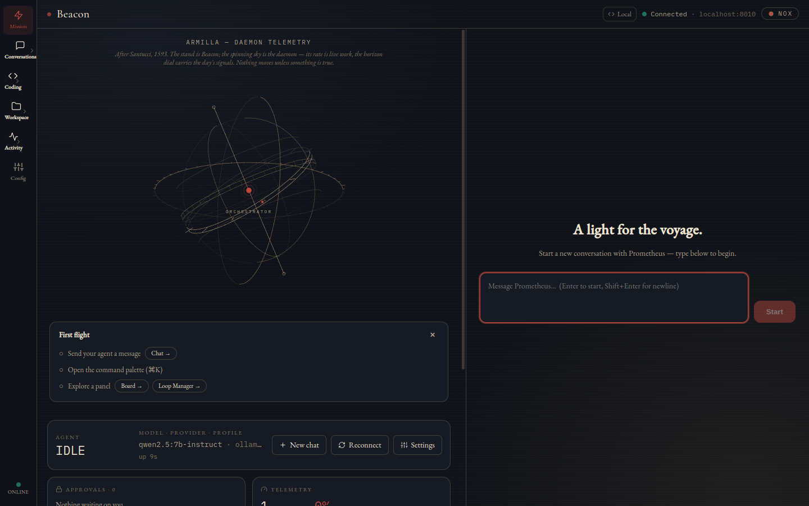
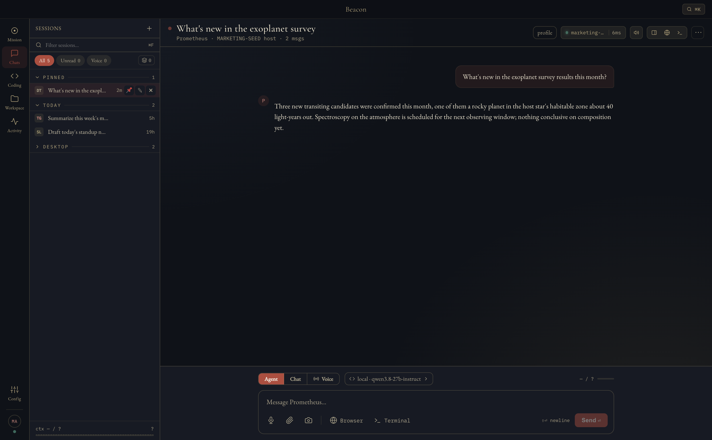
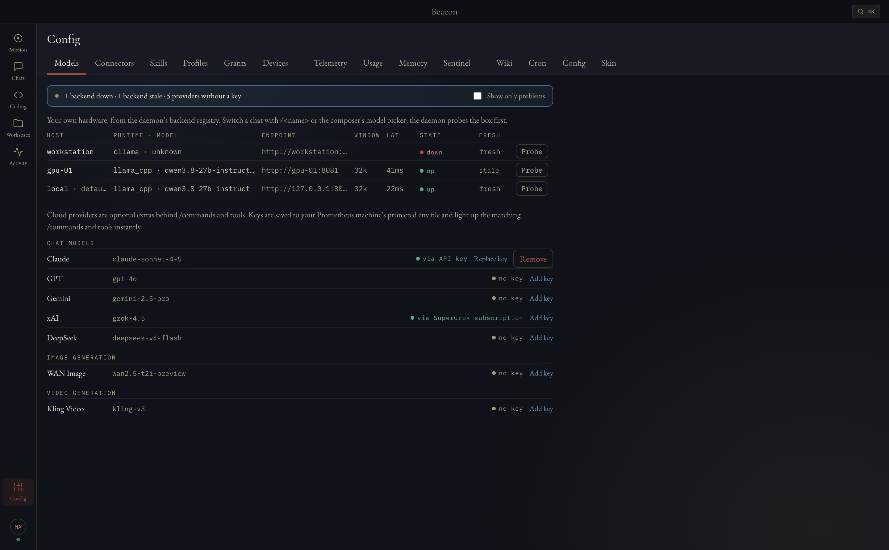
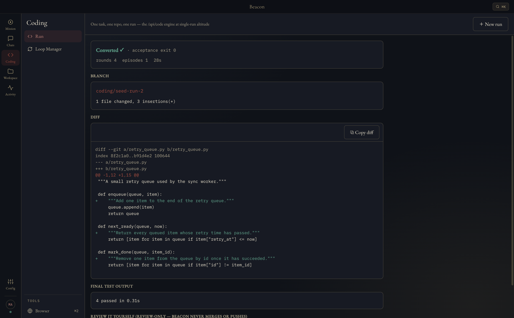
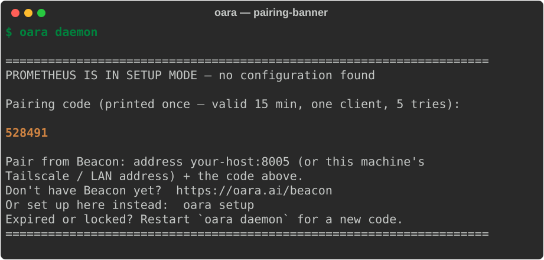
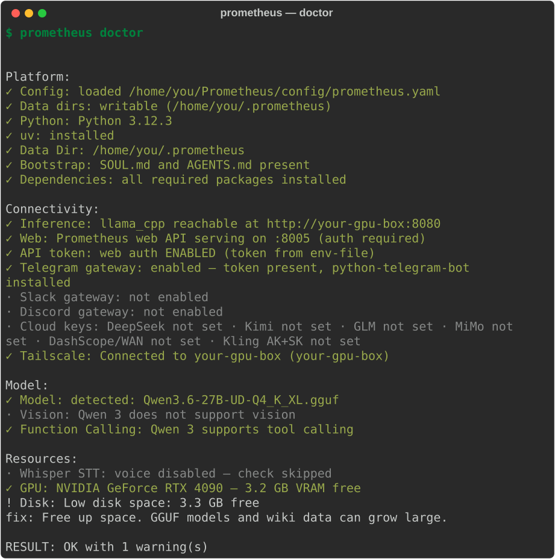
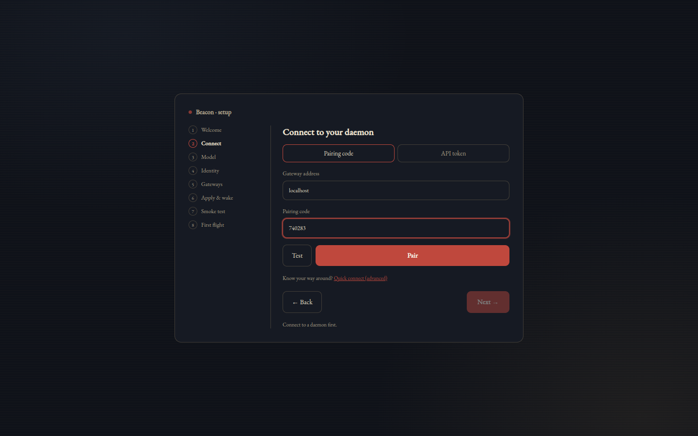

# Prometheus

A sovereign agent harness for local LLMs — the validation layer that makes open models actually reliable in a tool loop.

**The model is the agent. The harness is the vehicle.**



Prometheus is two pieces that pair with a 6-digit code:

- **The daemon** — an always-on Python agent runtime: agent loop + Model Adapter Layer, three chat gateways (Telegram / Slack / Discord), lossless memory, sandboxed coding runs, cron, a security gate, and a bearer-token REST + WebSocket control plane.
- **[Beacon](https://github.com/OAraLabs/beacon-desktop)** — its native desktop cockpit (macOS / Linux): chat with live tool timelines, Mission Control, a Loop Manager for coding runs, a documents editor with AI redlines, Kanban, telemetry feeds, and per-provider key management.

```bash
git clone https://github.com/OAraLabs/Prometheus.git && cd Prometheus
pip install -e '.[full]'
prometheus setup          # auto-detects llama.cpp / Ollama / LM Studio / vLLM
prometheus                # chat in the CLI
prometheus daemon         # always-on: web API + gateways + cron + background layer
```

`prometheus setup` probes for a running local inference server, generates your agent's identity, writes a working config with the web API enabled, and smoke-tests the loop. In a hurry? `prometheus setup --fast` (or `--noninteractive`) is the three-question version. On first daemon start a web API token is minted and printed once — `prometheus token show` re-prints it. If anything misbehaves: `prometheus doctor`.

> `pip install 'oara-prometheus[full]'` is the packaged path — CI builds sdist + wheel per tagged release; PyPI publishing lands once the release pipeline is public. Until then, the git checkout above is the path that works for everyone.

**What it gives you:**

- **Reliable tool calls on open models** — a Model Adapter Layer validates every call, auto-repairs common errors (fuzzy names, JSON inside markdown fences, type coercion), and enforces output schemas at the token level via GBNF for llama.cpp.
- **Always-on gateways** — Telegram, Slack, and Discord at parity (one shared command layer), with mid-turn `/steer` and `/queue` for durability while the agent is mid-task.
- **Visible memory that rides every prompt** — `MEMORY.md` and `USER.md` you can read, structured facts mined from conversations every 30 minutes, and passive recall that FTS-matches each message against the memory store and injects what's relevant.
- **Lossless context** — DAG-based compression with full-text search so long sessions don't drop facts; originals are always recoverable.
- **Sandboxed coding runs** — point it at a repo and an acceptance command; it iterates to green in a clone and hands you a reviewable branch. Never merges, never pushes.
- **Telemetry that stays home** — every tool call, repair, and token count logged to SQLite on your own disk and sent nowhere. It's the raw material for tuning the adapter and fine-tuning your own model: the data big labs keep for themselves, kept by you instead.
- **A desktop cockpit** — Beacon pairs to the daemon over your LAN or tailnet and gives every subsystem a native surface.

> **Status:** Active development. Expect rough edges. Fixes land weekly. Feedback welcome.

**Deeper docs** — the guide pages under [`docs/guide/`](docs/guide/):
[Install & first flight](docs/guide/install.md) · [Feature reference](docs/guide/features.md) · [Beacon desktop](docs/guide/beacon.md) · [Coding Mode & Loop Manager](docs/guide/coding-mode.md) · [Record a Skill](docs/guide/record-a-skill.md) · [Memory & knowledge](docs/guide/memory.md) · [Models & providers](docs/guide/providers.md) · [HTTP & WebSocket API](docs/guide/api.md)

---

## What we built from scratch

The interesting work is original:

- **Model Adapter Layer** — the gap between Claude-quality tool-calling and what open models actually produce. Validates, auto-repairs, enforces output schemas, retries with specific error context.
- **SENTINEL** — a proactive layer that watches for idle time and acts, instead of only reacting to prompts. Nudges, dreams, synthesizes.
- **Wiki Knowledge System** — turns every conversation into a compounding knowledge base that cross-references itself over time.
- **The coding engine's iterate-to-green policy** — "done" is a verdict, not a claim: sandboxed rounds until the acceptance command exits 0, with failure-fingerprint step-back and zero-progress aborts.
- **The fine-tuning gym** — frozen task-sets, dual scoring (raw emission vs post-repair execution), and a refusal to declare winners it can't statistically back.
- **SYMBIOTE** — code assimilation *and* self-modification. Scout researches GitHub, Harvest clones and vets (license gate, AST-level security scan), Graft adapts and integrates with provenance headers and a full test run, and MorphEngine hot-swaps the result via blue-green deploy with automatic rollback, backed by a backup vault. **Experimental, off by default** — powerful and unstable; treat it as a research feature.

### The guards

A passing test proves the code runs. It does not prove anything calls it. Every guard below exists because a feature was built, tested, green — and never wired; each one is a test that fails the build rather than a convention someone has to remember.

| The invariant | Enforced by |
|---|---|
| No source file may resolve the wiki root independently — one resolver, or the build fails | `test_no_site_resolves_the_wiki_root_independently` ([#131](https://github.com/OAraLabs/Prometheus/pull/131)) |
| Every key in the live config must exist in the shipped template — live ⊆ template, with no allowlist. (Compares against a real install, so it skips on a fresh clone where there is no live config to compare) | `test_every_live_config_key_exists_in_the_default_template` ([#133](https://github.com/OAraLabs/Prometheus/pull/133)) |
| A register of config keys with no reader that can only shrink — an unregistered key with no reader fails, *and* a registered key that gains one fails as stale | `test_no_new_config_key_without_a_reader` · `test_known_unread_register_is_not_stale` ([#136](https://github.com/OAraLabs/Prometheus/pull/136)) |
| A tool's advertised `example_call` must validate against its own schema — the example ships inside the tool advertisement, so a wrong one teaches the model a parameter that does not exist | `test_example_call_uses_real_param_names` ([#134](https://github.com/OAraLabs/Prometheus/pull/134)) |
| Every media and rate check declares fail-closed or fail-open at construction — the registry is built at module level, so an undeclared guard is an import error, not a test failure | `test_every_guard_declares_its_enforcement` · `test_a_guard_without_enforcement_cannot_be_constructed` ([#140](https://github.com/OAraLabs/Prometheus/pull/140)) |
| An acceptance test that terminates in a registered test double **fails** — registration is what makes a double detectable, wildcard exemptions are refused, and only individually-named doubles can be let through. An *unregistered* substitute is the known gap, and raises a loud warning rather than passing silently | `test_tripwire_end_to_end` — spawns a real inner pytest against the actual enforcement hook (TRIPWIRE, [#75](https://github.com/OAraLabs/Prometheus/pull/75)) |
| Every allowlisted file type must be provably **admitted**, not merely "not refused" — breach tests prove the door closes; only admission tests prove it opens | `test_every_advertised_document_extension_is_admitted` ([#141](https://github.com/OAraLabs/Prometheus/pull/141)) |

The last one is there because its absence shipped: a control suite whose every case asked "does disabling this let something bad through?" and none asked "does this let the permitted things through?" went green while the document surface silently degraded to PDF-only — 19 of 20 advertised types refused, including two the allowlist explicitly permitted. Over-refusal looks exactly like the control working.

### Provenance

**Provenance.** Prometheus is an original codebase, not a fork: 264 of its 313 Python modules were written from scratch — the other 49 are the adapted files named one-by-one in [NOTICE](NOTICE) — including everything that makes it interesting: the Model Adapter Layer, SENTINEL, SYMBIOTE, the Wiki Knowledge System, the coding engine, and the fine-tuning gym. Like most real software, it started on the shoulders of open source: early scaffolding (base file tools, cron, the engine skeleton) was adapted from MIT-licensed projects — chiefly [OpenHarness](https://github.com/HKUDS/OpenHarness), with smaller pieces from the [Hermes Agent](https://github.com/NousResearch/hermes-agent) and [OpenClaw](https://github.com/openclaw/openclaw) — and the engine has since diverged to under 4% code similarity with its starting point. Every adapted file names its source in a header comment; full notices are in [NOTICE](NOTICE). Several other subsystems (the gateways, LSP integration, teacher escalation) were designed by studying prior art and implemented clean-room.

---

## The Problem Nobody Else Solves

Open models are getting good at conversation. They're still terrible at *doing things*. Ask Qwen to call a tool and it hallucinates the tool name. Ask Gemma to return JSON and it wraps it in markdown. Ask Llama to chain three tool calls and it drops a required parameter on the second one.

Every other agent harness — LangChain, CrewAI, AutoGen — assumes the model will get tool calls right. That works fine when you're paying OpenAI. It falls apart the moment you point it at a local model.

Prometheus fixes this with a Model Adapter Layer that sits between your agent loop and whatever LLM you're running. Every tool call gets validated before execution, common errors get auto-repaired (fuzzy name matching, JSON extraction from markdown fences, type coercion), and when something still fails, the model gets specific error feedback with the actual schema — not a generic "try again." For llama.cpp, it goes further: GBNF grammar constraints force valid JSON at the token level, so the model literally can't produce malformed output.

The result: open models that reliably call tools, chain multi-step tasks, and run autonomously — without you babysitting every interaction.



## What Makes This Different

Prometheus isn't a wrapper around `ollama.chat()`. It's a complete agent operating system with novel systems that don't exist in other harnesses:

**The Model Adapter Layer is the core innovation.** Four cascading extraction strategies handle whatever mess the model produces. A retry engine feeds specific schema errors back to the model. GBNF grammar enforcement at the llama.cpp level makes invalid JSON structurally impossible. Telemetry tracks success rates per model per tool so you know exactly where your model struggles. Nothing else does this — other harnesses either assume clean output or crash.

**Lossless Context Management means your agent never forgets.** Every message is persisted to SQLite. When context fills up, a two-tier compression system kicks in: Tier 1 strips `tool_result` content from old messages (free — the output was already acted on). Tier 2 uses LLM-powered batch summarization when pruning alone isn't enough. But the originals are always recoverable — old messages get summarized into a DAG structure, and the agent can expand any summary back to full detail on demand. Full-text search across your entire conversation history. And memory isn't just storage: extracted facts ride back into each turn via passive recall, matched against what you just said.

**SENTINEL transforms the agent from reactive to proactive.** Most agents sit idle until you talk to them. Prometheus has a background intelligence layer that watches tool performance patterns, consolidates memory, lints its own knowledge base, and discovers cross-entity insights — all while you're away. Three of four phases use zero LLM calls. The fourth is budget-capped at 2,000 tokens. It nudges you via Telegram when it finds something interesting but never acts without permission.

**A compounding knowledge base inspired by Karpathy's LLM Wiki concept.** Every 30 minutes, a Memory Extractor pulls structured facts from your conversations, and the wiki recompiles the affected entity pages automatically — extraction and compilation are one loop, not a manual step. The wiki then maintains itself: SENTINEL's zero-LLM linter patrols for orphans, broken links, and stale pages; dedup gates keep repeated insights from piling up; and passive recall feeds the accumulated facts back into every turn. Point Obsidian at the markdown files and the graph view lights up.

**Infrastructure self-awareness via the AnatomyScanner.** At startup, Prometheus scans your hardware (CPU, RAM, GPU VRAM), detects the loaded model and its quantization, maps your Tailscale network peers, checks disk usage, and generates `ANATOMY.md` with Mermaid architecture diagrams of your entire setup. The agent knows exactly what machine it's running on, what model is loaded, and what resources are available.

**An evaluation framework with a local LLM judge.** Most agent evals require API calls to GPT-4. Prometheus uses constrained-decoding on your local model to judge task completion, tool usage accuracy, and hallucination — zero API cost. Failure classification (model vs harness vs unclear) and trend tracking across models and runs. The shipped config points the judge at a separate endpoint and pins the model that grades (`judge_base_url` + `evals.judge_model`); blank `judge_base_url` and the judge falls back to the endpoint under test, which means the model grades itself. Every score records which judge produced it either way.

**LSP integration for compiler-grade code intelligence.** Instead of grepping for function names, the agent queries language servers for real symbol definitions, type errors, and references. After every file edit, a diagnostics hook automatically checks for type errors and feeds them back to the model in the same turn. Off by default — one config flag turns it on.

## Open Models First, APIs Welcome

Prometheus is built for local inference. That's the whole point — sovereignty, privacy, no subscriptions. But it's not religious about it. If you want to use cloud models, the same harness works with:

- OpenAI (GPT-4o, o3-mini)
- Anthropic (Claude)
- Google Gemini (Flash, Pro)
- xAI (Grok) — via API key **or** by signing in with a SuperGrok subscription (OAuth device flow; no key needed)
- DeepSeek, Kimi (Moonshot), GLM (Z.ai), MiMo (Xiaomi)
- Any OpenAI-compatible endpoint (vLLM, LiteLLM, Together, etc.)

Switch any single chat with a slash command — `/claude`, `/gpt`, `/gemini`, `/xai`, `/deepseek`, `/kimi`, `/glm`, `/mimo` — and `/local` to come home. Keys are managed from Beacon's Models tab (paste once, live immediately, no restart) or the env file. The adapter layer adjusts its strictness automatically: full validation for open models, passthrough for APIs that already handle tool calling well.



The architecture doesn't care where the tokens come from. It cares that the tools get called correctly.

## Features

*The [feature reference](docs/guide/features.md) covers everything below in depth — including which subsystems are on by default and which are opt-in.*

Three commitments run through everything below:

**Refuses to lie to you.** Untrusted input — cron payloads, task output, file contents — carries provenance and is fenced off as data, not instructions, before the model sees it. A file-mutation verifier stat-checks every claimed edit and tells the model "CLAIMED but NO CHANGE ON DISK" when nothing actually changed. Telemetry keeps honest denominators (a failing test run is not a failed tool call), the daemon self-reports when it's running stale code, every swallowed exception lands in a queryable silent-failure ledger, "I'll let you know when it's done" must be backed by a real registered task, and a coding run's "done" is a verdict — the acceptance command re-run — not a claim.

**Survives you, restarts, and itself.** Sessions, background tasks, and message ids are durable contracts that outlive daemon restarts. The memory store heals itself — search-index rebuilds, snapshot backups before every migration, writes that either commit or raise. Signals persist before they broadcast, so a crash can never have told you something the disk doesn't know.

**Secure by construction, not by policy.** Tool sandboxes strip API keys from the environment — the agent cannot read its own credentials. The audit log redacts secrets before writing, outbound fetches resolve-and-block private address space, cron passes the same security gate at creation and at execution and fails closed, self-modification is gated behind a dangerous-code scanner, and agent deliverables are served by content id rather than by path.

### Model Independence

- Runs any model llama.cpp or Ollama can serve — Qwen, Gemma, Llama, Mistral, Phi, DeepSeek, Command-R
- Optimized formatters for Qwen and Gemma, default formatter works with everything else
- Auto-detects whatever model is loaded — swap the GGUF, restart, done
- 10+ providers: llama.cpp, Ollama, OpenAI-compatible (OpenAI/Gemini/xAI/DeepSeek/Kimi/GLM/MiMo), Anthropic
- Configurable adapter strictness: STRICT (small models), MEDIUM (Qwen/Gemma), NONE (cloud APIs)
- Per-session model override via slash command, REST, or Beacon's model switcher
- Deferred tool loading (tri-state, default `auto`): cloud models get the full tool catalog; local models get a compact deferred catalog that hands back roughly 8K tokens of context on a 32K window
- Cache-shaped context: the tool catalog is frozen at run start, any history rewrite is flagged, and mid-run compaction stays off on cloud providers — your prompt prefix is treated as a cache asset

### 40+ Builtin Tools

`bash`, `read_file`, `write_file`, `edit_file`, `grep`, `glob`, `web_search`, `web_fetch`, `youtube_transcript`, `download_file`, `browser` (Playwright), `image_generate`, `video_generate`, `tts`, `message`, `dashboard`, `notebook_edit`, `cron_create/delete/list`, `task_create/get/list/update/stop/output`, `todo_write`, `skill`, `agent` (subagent spawning), `ask_user`, `sessions_list/send/spawn`, `lcm_grep/expand/describe/expand_query`, `wiki_compile/query/lint`, `sentinel_status`, `audit_query`, `anatomy`, `lsp` (7 actions; when enabled), plus dynamic MCP tools (`mcp__{server}__{tool}`).

### Coding Mode — iterate to green

Point the agent at a repo, a task, and an acceptance command. It clones the repo into a sandbox (cwd jail, env-scrubbed so your provider keys never reach the subprocess), works in rounds until the acceptance command exits 0, and leaves a reviewable branch. **"Done" is a verdict, not a claim** — the session re-runs your acceptance command itself and rejects no-evidence turns. Mid-run supervision (pause / inject / resume) rides a control channel the run polls between episodes. Rounds stream live to Beacon.

- Supervision is fail-safe by construction: a corrupt or missing control file reads as "not paused", and a run with no control channel is byte-identical to an unsupervised one
- Repeated failures are caught by fingerprint: the failure output is normalized (timings, addresses) and hashed, so hitting the same wall twice triggers an explicit step-back — and zero-progress runs abort instead of burning rounds



Beacon's **Loop Manager** turns this into a PM cockpit: register repos, keep a `TASKS.md` board, edit the `LOOP.md` run contract, and fire — Autonomous, Composed, or Supervised. Kanban stories can be dispatched straight into coding runs. See the [Coding Mode guide](docs/guide/coding-mode.md).

### Skills

The agent writes skills for itself: the SkillCreator turns successful multi-step traces into markdown skill files, the SkillRefiner updates them when better executions come along, and a weekly Curator pass consolidates and prunes (pinned skills are protected; nothing is hard-deleted). Three core skills ship in the package (`commit`, `debug`, `plan`), and the repo carries a **102-file skill library** in [`skills/`](skills/) you can drop into `~/.prometheus/skills/` selectively — it's deliberately not auto-loaded, to keep prompts lean. GEPA (evolutionary skill optimization, judged by your local model) is available as an opt-in idle-time layer — and it runs every candidate through a dangerous-code scanner before promotion.

### Record a Skill

Show the agent a workflow instead of describing it. Two capture paths, two trust levels:

- **Live DOM recording** — record a browser workflow; a deterministic pipeline (no model calls) turns the event trace into a skill, runs it through a five-check quality gate, and auto-persists it to `skills/auto/`
- **Video / YouTube ingestion** — screen recordings and videos are transcribed and vision-digested into skill drafts that **never** auto-persist: they wait in Beacon for human accept or reject

Ground-truth DOM traces earn autonomy; lossy vision output stays human-reviewed. Full walkthrough: [Record a Skill guide](docs/guide/record-a-skill.md).

Why this only works here: a screen recording of you doing your job is among the most revealing data you own, and every frame of it stays on your disk. A hosted product can't offer the same feature, because shipping your screen to someone else's server *is* the feature — and the problem.

### MCP Integration

- Dynamic tool discovery from any MCP server
- Collision-free naming (`mcp__{server}__{tool}`), stdio transport today (HTTP/SSE planned), config fingerprinting
- Context7 is a two-line config away for up-to-date library documentation

### Identity System

- **SOUL.md** — persistent identity loaded into every prompt. Survives `/reset`. Generated at setup — no hardcoded names.
- **AGENTS.md** — agent registry with specializations for subagent spawning
- **ANATOMY.md** — live infrastructure snapshot with Mermaid diagrams (hardware, VRAM, model + quant, Tailscale peers), queryable via the `anatomy` tool
- **MEMORY.md + USER.md** — the agent learns who you are over time (bounded: 12K + 8K chars)
- **Agent Profiles** — `full`, `coder`, `research`, `assistant`, `minimal` via `/profile` to trade tool breadth for context budget

### Security

- 4-level trust model (BLOCKED → APPROVE → AUTO → AUTONOMOUS), origin-aware: background work (SENTINEL, cron, gym) faces stricter gates than what you ask for directly
- 8 always-blocked command patterns plus configurable deny lists and bash intent analysis, plus a workspace boundary on `write_file` / `edit_file` — **a speed bump, not confinement**: `bash` is gated on the command string, not on the paths a command writes to, so a shell redirect goes anywhere. `denied_paths` is the hard stop, and a turn-end check detects writes that landed outside the permitted area — after the fact, without undoing them. [What each one actually catches](docs/guide/features.md#security)
- Untrusted-input fencing: every message carries a provenance tag, and content from cron jobs, task output, and files is wrapped as data — not instructions — before it reaches the model
- Secrets structurally absent: tool sandboxes strip key/token/secret variables from the environment (the agent can't `env` its own keys), the audit log redacts before writing, key updates reject control characters, and key reads return booleans — never values
- SSRF-hardened outbound: `web_fetch` and `download_file` resolve DNS and refuse private, loopback, and link-local address space before any request leaves the machine
- Rate limiting on the public chat surface: a per-chat budget with a global ceiling above it, so one peer can't exhaust the daemon and the aggregate is capped even when every chat is individually under. Messages and media carry **separate** budgets, a refusal doesn't consume budget, and the sender is warned once per window rather than per message
- Inbound media is checked cheapest-and-earliest-first: declared MIME before any transfer, then the size cap **before download** — then the download itself runs under a hard byte ceiling, because `file_size` is supplied by the peer and the pre-check believed it. Magic bytes are sniffed after, and a declared type that disagrees with the sniffed one is refused; that's the renamed-extension case
- Media cache is LRU-bounded with a free-disk floor, and classified as a convenience: an unwritable or full cache declines to cache, never to serve
- **The honest limit:** signature-less text formats have no magic bytes to verify, so they are admitted on their declared type — trusted, but bounded by the allowlist. That's strictly weaker than verifying bytes and strictly stronger than refusing the type outright, which is what it replaced (and which protected nothing while breaking everything)
- Cron is not a bypass: jobs pass the security gate at creation **and** again at execution; blocked runs are recorded and reported — fail closed
- Audit logging (SQLite + JSONL, queryable via `/audit`), exfiltration detection, prompt-injection defense
- Approval queue — `/approve`, `/deny`, `/pending` via Telegram, or one-click Approve/Deny cards in Beacon
- Authenticated control plane — bearer-token REST plus first-frame token auth on the WebSocket bridge
- Secrets live in `~/.config/prometheus/env`, never in the yaml; a pre-commit hook scans staged blobs for provider keys and this project's own opaque tokens before anything lands in the repo

### Always-On

- Telegram gateway with photo (vision captioning), voice (Whisper STT), document (20+ formats), and sticker handling
- Slack gateway (Socket Mode) at Telegram parity: 45 slash commands, thread-based long replies, channel whitelists
- Discord gateway at the same parity: `/prometheus` app commands, DM + guild/channel whitelists
- Cron scheduler (natural-language scheduling supported), heartbeat monitoring, systemd service
- Durable background tasks (`tasks.db` survives restarts) with an honesty check: "I'll let you know when it's done" must be backed by a real registered task — and tasks orphaned by a restart are marked failed instead of pretending to still run
- 40+ slash commands on Telegram — including mid-turn `/steer`, `/queue`, and per-chat provider overrides
- **Paperclip fleet gateway** (experimental, off by default) — Prometheus as a hireable agent: a fleet manager wakes it over HTTP, it checks out an issue, works a turn, reports back, and bills from real token usage

### Sessions that behave like sessions

- **They survive restarts** — the session list is durably indexed, so a daemon restart restores every conversation; "Forget" is a durable tombstone that new activity revives
- **You can stop a running turn** — interrupt over WebSocket or REST; completed rounds persist and the partial reply is kept as a real assistant turn, not discarded
- **Liveness you can trust** — a progress pulse (phase / tool / round / elapsed) every few seconds distinguishes a long turn from a dead daemon, and failures arrive classified — a billing error says it's a billing error and how to fix it, instead of a blank timeout
- **An outbox for deliverables** — files the agent produces land in `~/.prometheus/files` and are served by content id (renames don't break links, no path-traversal surface); Beacon shows them as download chips
- **A real sync contract** — every message has a durable id that doubles as a cursor, so clients resync incrementally after any disconnect

### Documents & Board

- **Documents editor** — a confined documents folder served over the API; Beacon gives it a calm writing surface with auto-save and **Ask AI redlines**: describe a change, get `{find, replace, reason}` edits as inline tracked-changes, accept or reject each one. Nothing touches disk until you accept.
- **Kanban board** — projects and stories over REST, drag-and-drop in Beacon, and stories dispatchable into coding runs.

### Image & Video Generation

- `image_generate`: Pollinations (free, hosted), ComfyUI (free, local GPU), or WAN 2.5 via DashScope (paid). `auto` never selects the paid backend.
- `video_generate`: Kling 3.0 text/image-to-video (paid, dormant until keyed).
- Details in the [providers guide](docs/guide/providers.md).

### Fine-Tuning Flywheel (in progress)

- Successful tool-call traces and adapter repair-pairs are captured, stored, and mined into an exportable dataset (capture → store → miner → export); browse with `/pairs`
- Using the big model *is* collecting the corpus: first-try cloud successes are flagged golden at write time and banked as training examples for the local model
- A gym runs frozen task-sets against live models with deterministic **dual scoring** (raw emission vs post-repair execution) and refuses to declare winners below sample-size thresholds
- The gym also refuses untrustable results by construction: it probes the backend before starting, rejects two-variable experiments outright, and pins task-set and manifest hashes into every run
- Corpus harvesting is Goodhart-proofed: pairs are classified by transition type with per-type caps, after one harvest came back 97% a single pattern
- This is the data-collection half of a LoRA loop for the local model; the training step itself is still on the roadmap

### Observability

**Telemetry that stays home.** Local-first people rightly refuse telemetry — because it usually means someone else's server. Prometheus inverts it: every tool call, repair, token count, and failure is recorded to SQLite on your own disk and sent nowhere — the telemetry module contains no network code at all, and the optional tracing exporter is off by default and points at localhost. It exists so *you* hold the data the big labs keep for themselves: the per-model success rates that tune the adapter, the golden traces that become your fine-tuning corpus, and the receipts for what your model actually did. And it's neither slow nor bloated — WAL-mode appends cost sub-milliseconds next to tool calls that take seconds, and months of heavy daily use produce a database around 11 MB. Don't want it anyway? `infrastructure.telemetry_enabled: false` is one line, and `prometheus --reset-telemetry` wipes the slate whenever you like.

- Tool-call telemetry (SQLite) — success rates per model per tool, surfaced in Beacon's Tool Feed and `/health` — with honest denominators: a correctly executed command whose task fails (pytest exit 1) is not counted against the model
- Every claimed file mutation is verified against disk — created / modified / deleted / **no change** — and "CLAIMED but NO CHANGE ON DISK" goes back to the model on its next turn
- Every model call wrapped in an `LLMCallEnvelope` — per-round token accounting, and every swallowed exception lands in a queryable silent-failure ledger before any failure policy runs
- Per-round prompt-cache stats (cached vs cache-write tokens, hit ratio) across providers — a provider that doesn't report is recorded as unknown, never as a fake zero
- The daemon knows when it's stale: `/api/status` reports the running SHA against the repo's HEAD, so merged-but-not-restarted can never masquerade as deployed
- Phoenix/OpenTelemetry tracing — env-gated, zero-cost no-ops when off
- Failure classification in evals (model vs harness vs unclear) with trend tracking — the judge runs on your local endpoint; `judge_base_url` chooses it and `evals.judge_model` pins which model grades
- **Every score records which judge produced it** — base URL, model, and whether that model was *pinned* or auto-detected from whatever the endpoint had loaded. `pinned` is the field that matters and can't be inferred from the model name: an auto-detected judge that resolves to `qwen2.5:7b-instruct` records the same name as one pinned to it, but only the pinned run is reproducible. Result files written before this carry no judge key at all — that means **unknown**, permanently, and they must not be compared across paths. Backfilling them would manufacture exactly the false provenance the change exists to prevent

### On by default vs opt-in

Chat, tools, adapter, memory + LCM + passive recall, security gate, telemetry, and the web API are on out of the box. The bigger autonomous subsystems — SENTINEL dreaming, the model router, LSP, GEPA, escalation-to-teacher, SYMBIOTE (GitHub research → license gate → AST scan → safe graft → blue-green hot swap with auto-rollback; experimental), the Paperclip gateway, and Record-a-Skill's video ingestion — ship **off by default** and are one config flag away when you want them. The [feature reference](docs/guide/features.md) marks every subsystem's default.

## Quick Start

### Prerequisites

- Python 3.11+
- llama.cpp or Ollama running with any model loaded (or a cloud API key)
- A Telegram bot token (from @BotFather) — optional, CLI works without it

### Install

```bash
git clone https://github.com/OAraLabs/Prometheus.git && cd Prometheus
pip install -e '.[full]'
prometheus setup
```

The setup wizard generates your personalized identity, detects your inference server (llama.cpp:8080, Ollama:11434, LM Studio:1234, vLLM:8000), writes the config with the web API **enabled**, and runs a smoke test. No server running? The wizard offers a remote URL, a cloud provider, or copy-paste install instructions — it never writes a config it knows is broken.

Variants:

```bash
prometheus setup --fast            # quick path: probe → yaml → env, 3 questions
prometheus setup --noninteractive  # zero questions (first detected server, CLI gateway)
prometheus setup --gateway-only    # add/change Telegram, Slack, or Discord later
```

Prefer doing setup from a couch? Skip `prometheus setup`, run `prometheus daemon` bare, and it boots in **setup mode** — a pairing-only API that prints a one-time 6-digit code. Beacon's wizard takes it from there (detects backends, names the agent, configures gateways) and the daemon wakes fully configured:



### Run

```bash
prometheus                                        # interactive CLI
prometheus --once "List the Python files here"    # one-shot
prometheus daemon                                 # always-on
```

On the first daemon start, Prometheus mints a secure `PROMETHEUS_API_TOKEN`, saves it to `~/.config/prometheus/env`, and prints it **once**:

```bash
prometheus token show     # re-print the token
prometheus token rotate   # invalidate + mint a new one
curl -H "Authorization: Bearer $(prometheus token show | head -1)" http://localhost:8005/api/status
```

### Run as a systemd service (Linux)

```bash
prometheus install-service          # writes ~/.config/systemd/user/prometheus.service
systemctl --user start prometheus
journalctl --user -u prometheus -f
```

### When something is off

```bash
prometheus doctor
```



Exit code is nonzero when anything is broken, so it also works in scripts.

### Get Beacon

Beacon is currently private while it hardens; public builds — macOS dmg, Linux AppImage/deb — arrive with the public release. Early users get draft builds. First launch walks you through pairing — the full flow with screenshots is in the [install guide](docs/guide/install.md), and the app tour is in the [Beacon guide](docs/guide/beacon.md).



### Where the config lives (search order)

1. an explicit `--config` path
2. `config/prometheus.yaml` — repo-local (checkout installs; gitignored)
3. `$PROMETHEUS_CONFIG_DIR/prometheus.yaml` — default `~/.prometheus/prometheus.yaml`

Secrets never go in the yaml — they live in the env file `~/.config/prometheus/env`, which both `prometheus daemon` and the systemd unit load.

### Multi-Machine Setup

Run the agent on one machine, point it at a GPU machine for inference:

```yaml
model:
  provider: "llama_cpp"
  base_url: "http://gpu-machine:8080"
  fallback:
    - provider: "ollama"
      base_url: "http://gpu-machine:11434"
    - provider: "anthropic"
      api_key_env: "ANTHROPIC_API_KEY"
      model: "claude-haiku-4-5-20251001"
```

Connect via Tailscale, WireGuard, or any network — Beacon pairs over the same address. Prometheus talks HTTP; localhost or remote, it doesn't care.

### What About Smaller GPUs?

16GB VRAM runs Gemma 2 9B or Qwen 2.5 14B (Q4 quantized). Set `strictness: STRICT` — the adapter compensates with more validation and retries. No GPU at all? Use a cloud provider and you still get the full harness: memory, wiki, SENTINEL, security, profiles, all of it.

## Architecture

```
┌──────────────────────────────────────────────────────────┐
│                    INTERFACE LAYER                        │
│  Telegram │ Slack │ Discord │ CLI │ Beacon desktop        │
│           (REST :8005 + WebSocket :8010, token-authed)    │
└────────────────────────┬─────────────────────────────────┘
                         │
┌────────────────────────┴─────────────────────────────────┐
│                  ALWAYS-ON LAYER                          │
│  Heartbeat │ Cron │ SENTINEL │ Memory Extractor │ Tasks   │
└────────────────────────┬─────────────────────────────────┘
                         │
┌────────────────────────┴─────────────────────────────────┐
│                 ORCHESTRATION LAYER                       │
│  Agent Loop → Model Adapter → Tool Dispatch               │
│  ┌──────────────────────────────────────────────────┐     │
│  │  MODEL ADAPTER LAYER                             │     │
│  │  Validator │ Formatter │ Enforcer │ Retry │ Telem │     │
│  └──────────────────────────────────────────────────┘     │
│  Model Router │ Coding Mode │ LSP │ MCP │ Subagents       │
└────────────────────────┬─────────────────────────────────┘
                         │
┌────────────────────────┴─────────────────────────────────┐
│               IDENTITY & KNOWLEDGE LAYER                  │
│  SOUL.md │ AGENTS.md │ ANATOMY.md │ Profiles              │
│  LCM (DAG compression) │ Wiki │ MEMORY.md │ Passive recall│
└────────────────────────┬─────────────────────────────────┘
                         │
┌────────────────────────┴─────────────────────────────────┐
│                 MODEL PROVIDER LAYER                      │
│  llama.cpp │ Ollama │ OpenAI │ Anthropic │ Gemini │ xAI   │
│  DeepSeek │ Kimi (Moonshot) │ GLM (Z.ai) │ MiMo (Xiaomi)  │
│  (xAI: API key or SuperGrok subscription OAuth)           │
└──────────────────────────────────────────────────────────┘
```

## Configuration

```yaml
model:
  provider: "llama_cpp"              # or ollama, openai, anthropic, gemini, xai,
                                     #    deepseek, kimi, glm, mimo
  base_url: "http://localhost:8080"
  # model auto-detected from llama.cpp on startup

context:
  effective_limit: 24000
  compression_trigger: 0.75

security:
  permission_mode: "default"
  workspace_root: "~/.prometheus/workspace"   # or a list of roots
  # This is the SHIPPED default (an earlier note here claimed it was "~" —
  # that was wrong). A path outside every root makes write_file/edit_file ask
  # first; it does not make the write impossible. See the note below.

gateway:
  telegram_enabled: true   # default: false — setup enables it when you add a token
  # token via env: PROMETHEUS_TELEGRAM_TOKEN

memory:
  recall:
    enabled: true      # passive recall — stored facts ride each turn

sentinel:
  enabled: false       # opt-in: idle-time dreaming, wiki lint, synthesis
  dream_budget_tokens: 2000

wiki:
  root: ~/.prometheus/wiki   # the wiki is relocatable — every consumer
                             # resolves through this one key

heartbeat:
  maintenance_db: ""   # path to a SQLite file with a maintenance(until_ts) row.
                       # While the window is open, the "merged-but-dark" drift
                       # nudge is suppressed — the merge-to-restart gap is
                       # exactly when drift is expected. Empty = off; fails OPEN.

profile:
  active: "full"       # full | coder | research | assistant | minimal
```

## Gateways

Three messaging gateways, all first-class: every onboarding surface (`prometheus setup`, the fast path, the remote setup API, and Beacon's wizard) can enable any subset, and `prometheus doctor` reports each one's state.

| Gateway | What you need | Env vars | Extra |
|---------|---------------|----------|-------|
| **Telegram** | A bot token from [@BotFather](https://t.me/BotFather) (`/newbot`) | `PROMETHEUS_TELEGRAM_TOKEN` | built-in |
| **Slack** | A Slack app ([api.slack.com/apps](https://api.slack.com/apps)) with Socket Mode — **both** tokens: bot (`xoxb-…`) + app-level (`xapp-…`) | `PROMETHEUS_SLACK_BOT_TOKEN`, `PROMETHEUS_SLACK_APP_TOKEN` | `pip install 'oara-prometheus[slack]'` |
| **Discord** | A bot from the [developer portal](https://discord.com/developers/applications) with **Message Content Intent**, invited with `bot` + `applications.commands` scopes | `PROMETHEUS_DISCORD_TOKEN` | `pip install 'oara-prometheus[discord]'` |

Tokens live in the env file, never in the yaml. The easiest way to configure any of them is `prometheus setup --gateway-only`.

## Commands

The full 40+ command surface is in the [feature reference](docs/guide/features.md#commands); the daily drivers:

| Command | Description |
|---------|-------------|
| `/status` `/health` `/context` | Model, uptime, subsystem health, token budget |
| `/steer` | Inject a mid-turn course-correction while the agent is working |
| `/queue` `/unqueue` | Line up follow-up messages while it's busy |
| `/wiki` `/note` `/memory` | Knowledge base stats, quick capture, memory files |
| `/skills` `/profile` `/anatomy` | Skills, agent profiles, infrastructure snapshot |
| `/approve` `/deny` `/pending` | Human-in-the-loop approval queue |
| `/claude` `/gpt` `/gemini` `/xai` `/deepseek` `/kimi` `/glm` `/mimo` | Per-chat cloud override |
| `/local` `/route` | Back to the local model · show this chat's routing |
| `/sentinel` `/gepa` `/curator` `/symbiote` `/audit` | The opt-in autonomous layers |

Cloud slash-commands are configurable per command (provider, key env, model) in `prometheus.yaml` — see the [providers guide](docs/guide/providers.md).

## Benchmarks

```bash
python -m prometheus.benchmarks.runner --model gemma4-26b --tier 1
```

Results from a 2026-06 run — Gemma 4 26B on an RTX 4090:

```
Tasks: 19  |  OK: 19  |  Errors: 0
Avg latency: 1.4s  |  Total: 27s

Tool Usage      : 97.4%
Task Completion : 100%
No Hallucination: 84.7%
```

All evaluation runs locally — the LLM judge uses constrained decoding on your own hardware. The shipped config gives the judge its own endpoint and pins the grading model (`judge_base_url` + `evals.judge_model`); leave `judge_base_url` blank and the judge falls back to the endpoint under test, i.e. the model grades itself. Each score carries its judge's provenance, so two runs can be compared — or refused comparison.

## Project Structure

```
prometheus/
├── src/prometheus/
│   ├── engine/          # Agent loop, sessions, streaming, honesty check
│   ├── adapter/         # Model Adapter Layer (validator, formatter, enforcer, retry)
│   ├── providers/       # llama_cpp, ollama, openai_compat, anthropic, xai_oauth, registry
│   ├── tools/builtin/   # 49 builtin tools
│   ├── coding/          # Sandboxed iterate-to-green runs + supervision + livestream
│   ├── hooks/           # PreToolUse / PostToolUse + hot reload + LSP diagnostics
│   ├── permissions/     # Security gate + audit + exfiltration + approval queue
│   ├── memory/          # LCM engine, wiki compiler, extractor, passive recall
│   ├── context/         # Token budget, compression, prompt assembly
│   ├── gateway/         # Telegram, Slack, Discord, cron, heartbeat, paperclip
│   ├── web/             # REST API, WebSocket bridge, setup-mode server, artifacts
│   ├── documents/       # Confined documents service + AI redline suggestions
│   ├── kanban/          # Projects + stories store
│   ├── sentinel/        # Observer, AutoDream, wiki lint, consolidation, digest
│   ├── mcp/  lsp/       # MCP runtime · language-server client
│   ├── evals/  gym/     # Local-judge evals · fine-tuning gym (dual scoring)
│   ├── coordinator/     # Subagent spawning, divergence detection
│   ├── learning/        # Skill creator/refiner, curator, GEPA, pair capture,
│   │                    #   live recorder + video ingest (Record a Skill)
│   ├── symbiote/        # Code assimilation + self-modification (experimental, off by default)
│   ├── infra/           # AnatomyScanner, project configs
│   ├── telemetry/       # Tool-call tracking + cost
│   └── config/          # Settings, paths, env overrides, profiles
├── templates/           # Identity templates (no personal data)
├── skills/              # 102-file skill library (.md, opt-in)
├── tests/               # 4,000+ tests across 239 files
├── docs/                # Guides, architecture, sprint reports
│   └── guide/           # Install · features · Beacon · coding · skills · memory · providers · API
├── gym/                 # Frozen task-sets, harvest corpus
├── packaging/           # systemd unit
└── PROMETHEUS.md        # Agent instructions (like CLAUDE.md)
```

## Stats

- ~83,000 lines of production Python across 313 modules
- 4,000+ tests across 239 test files
- 49 builtin tools registered by default (plus config-gated LSP, MCP, and vision/STT tools) + dynamic MCP tools
- 102-file skill library + self-authored skills
- 10+ model providers (local and cloud)
- 88 REST routes (83 on the main API, 5 on the setup-mode pairing server) + an authenticated WebSocket event bridge
- A native desktop cockpit with 13 views

## Roadmap

- [x] Core agent loop with Model Adapter Layer (validation, repair, GBNF, retry, telemetry)
- [x] Lossless Context Management (DAG compression, FTS5 search) + passive recall
- [x] Security (4-level trust, audit, exfiltration, approval queue)
- [x] Telegram + Slack + Discord gateways at parity
- [x] Wiki knowledge system (Karpathy-inspired, Obsidian-compatible)
- [x] SENTINEL proactive layer (observer + AutoDream)
- [x] Coding Mode v2 — sandboxed iterate-to-green + mid-run supervision + live streaming
- [x] Beacon desktop app — pairing wizard, Mission Control, Loop Manager, Documents, Kanban
- [x] Cloud expansion — DeepSeek/Kimi/GLM/MiMo + WAN image + Kling video
- [x] xAI SuperGrok subscription OAuth
- [x] Model router with fallback chains + divergence detection
- [x] Evaluation framework with local LLM judge + fine-tuning gym (dual scoring)
- [x] LSP integration, MCP integration, migration tool (Hermes/OpenClaw)
- [x] Durable sessions, turn interrupt, liveness pulse, artifact outbox
- [x] Record a Skill — live DOM demonstration capture + video/YouTube ingestion
- [ ] Fine-tuning flywheel (LoRA on collected traces) — *capture/export pipeline shipped; training loop pending*
- [ ] PyPI release + published Beacon builds
- [ ] Beacon: attach to running coding runs, pause/inject/resume from the UI

## License

MIT — see [LICENSE](LICENSE). Upstream copyright notices for adapted code are collected in [NOTICE](NOTICE).

## Credits

Built by [Will Hieber](https://github.com/OAraLabs) / OAra Labs. Its design was informed by Andrej Karpathy's [LLM Wiki concept](https://gist.github.com/karpathy/442a6bf555914893e9891c11519de94f), [Lossless-Claw](https://github.com/Martian-Engineering/lossless-claw), and [Sigrid Jin's](https://github.com/instructkr) analysis of Claude Code's agent-loop patterns. Code lineage and upstream notices: see [Provenance](#provenance) above and [NOTICE](NOTICE).
