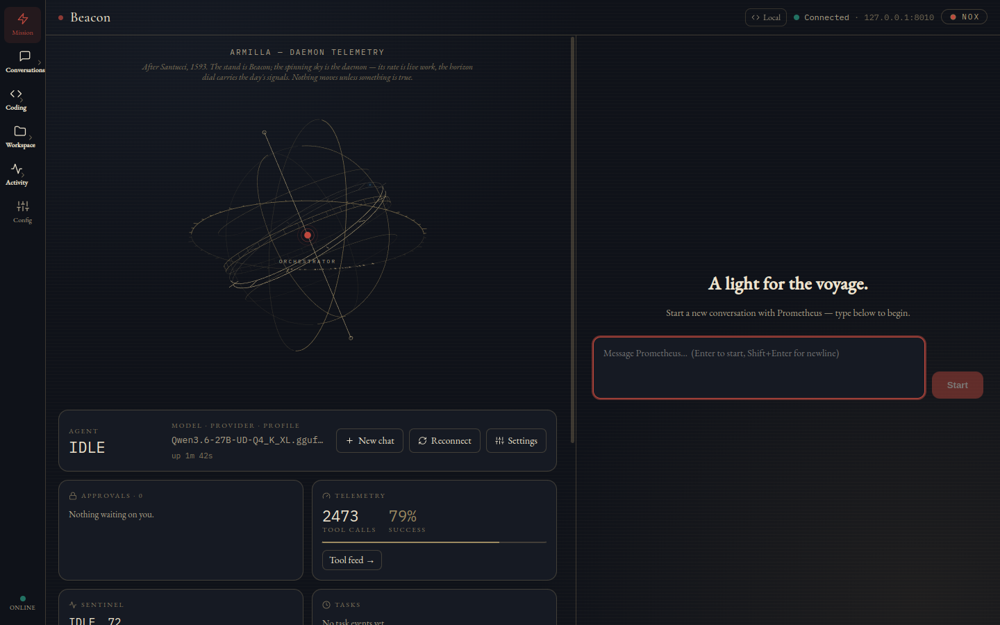
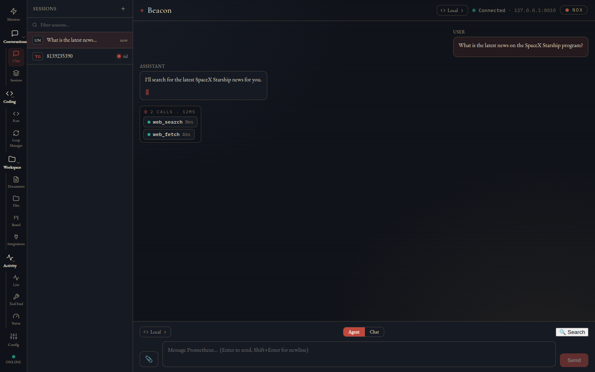
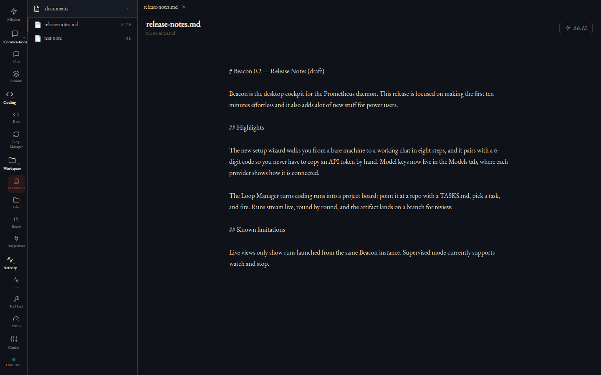
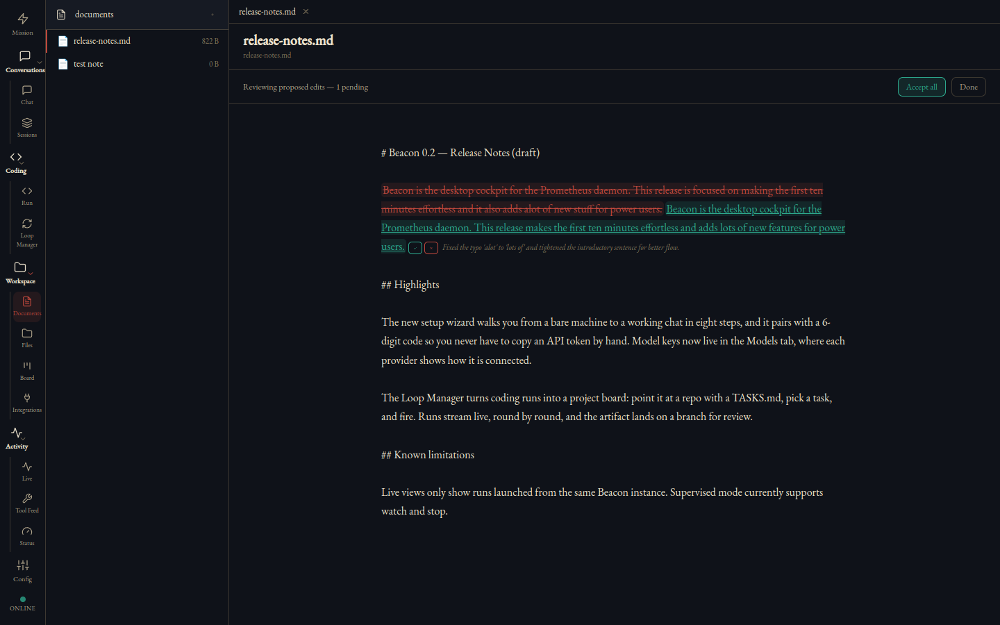
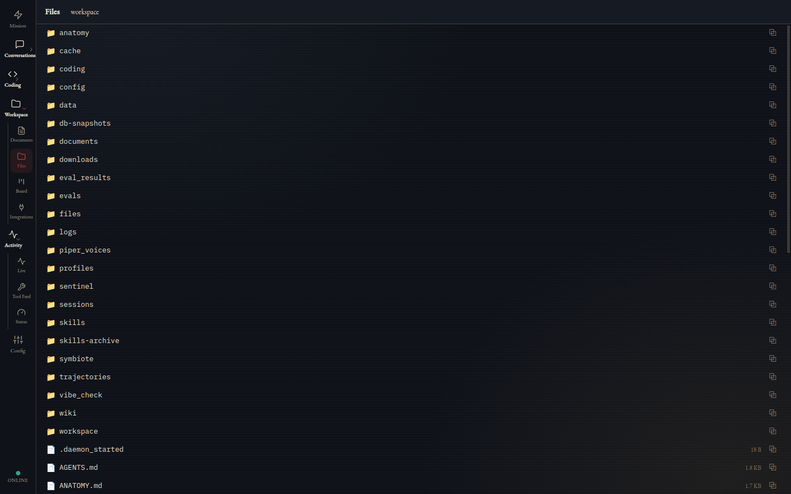
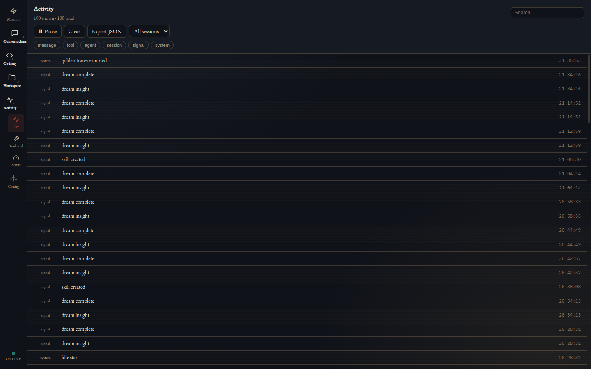
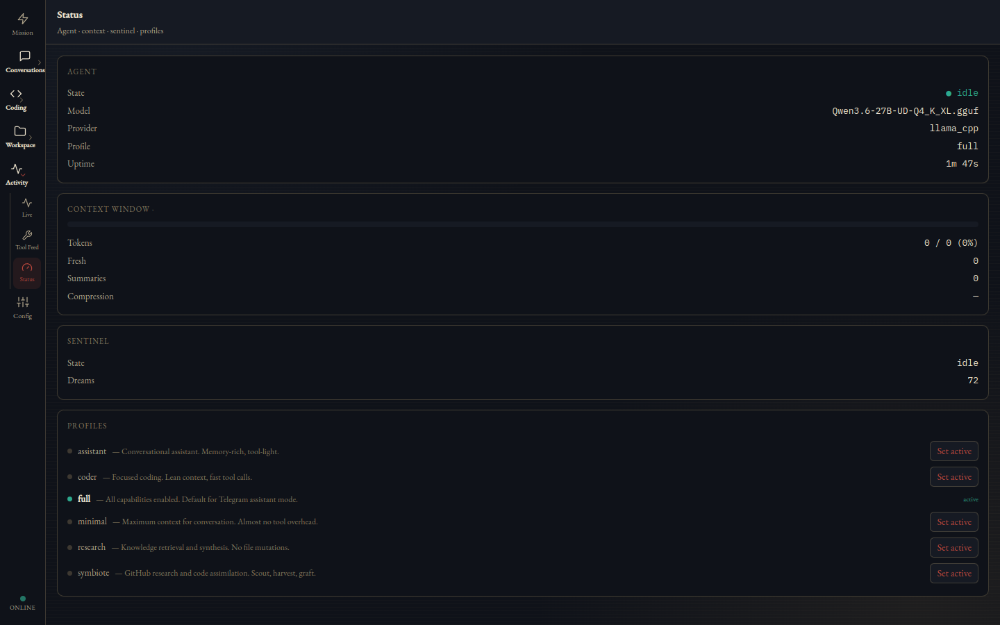
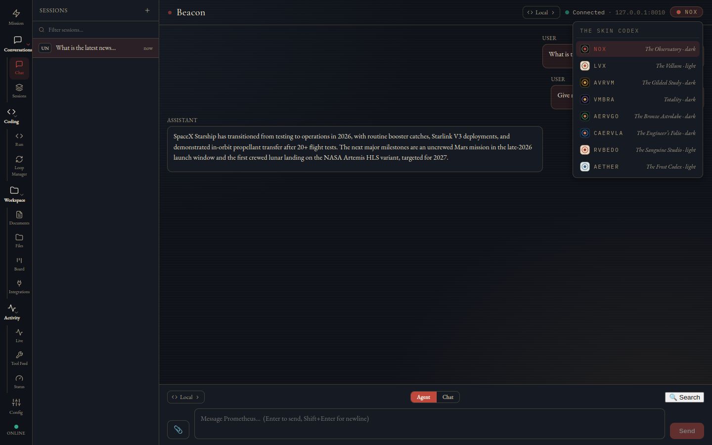

# Beacon — the desktop cockpit

Beacon is the native desktop client for the Prometheus daemon — an Electron app for macOS and Linux that bundles **no backend and no model keys**. It pairs to a running daemon over REST (`:8005`) and an authenticated WebSocket (`:8010`), stores your API token in the OS keychain, and works just as well over Tailscale as it does on localhost. The daemon is the single source of truth; Beacon is the window into it — chat with live tool timelines, Mission Control, a Loop Manager for coding runs, a documents editor with AI redlines, Kanban, telemetry feeds, and per-provider key management.

[← README](../../README.md)


## Getting Beacon

Grab a build from [beacon-desktop releases](https://github.com/OAraLabs/beacon-desktop/releases) — a macOS `.dmg` or a Linux `.AppImage`/`.deb`. Two honest caveats: macOS builds are **unsigned** unless Apple credentials were in the build environment, so Gatekeeper will complain the first time — right-click → Open gets you past it. And there is **no auto-update channel** yet; new versions are a manual download.

Building from source is quick if you'd rather:

```bash
git clone https://github.com/OAraLabs/beacon-desktop.git && cd beacon-desktop
npm install
npm run dev        # dev mode
npm run dist       # packaged build for your platform
```

First launch drops you into a stepped setup wizard that connects to your daemon — either with a 6-digit pairing code (if the daemon booted in setup mode) or an API token — then walks through model detection, agent identity, and optional chat gateways. The full pairing walkthrough with screenshots lives in the [install guide](install.md).


The token you pair with goes into the OS keychain via Electron's `safeStorage` and never reaches the renderer process — Beacon's UI can see that a token is saved, but never the token itself.

## The nav

Thirteen views, organized into collapsible groups in a left rail. Groups remember whether you left them open, and the active view's group is always forced open so you can't lose your place:

- **Mission** — the default landing view
- **Conversations** — Chat · Sessions
- **Coding** — Run · Loop Manager
- **Workspace** — Documents · Files · Board · Integrations
- **Activity** — Live · Tool Feed · Status
- **Config**

The foot of the rail pins a global connection indicator — more on that in [Cross-cutting UX](#cross-cutting-ux).

## Mission

Mission is where Beacon lands you: a banner, a first-flight checklist (right after setup), a chat composer so you can start talking immediately, and two live instruments.



**Mission Control** is the cockpit HUD. A hero card shows the agent's current state (it glows while thinking) alongside model, provider, active profile, and uptime, with quick actions underneath. Around it: an **Approvals** card with one-click Approve/Deny for anything the agent is blocked on, a telemetry headline, a **Sentinel** card (state plus dream count), a task ticker, and a recent-activity strip.

**The Armilla** is the armillary sphere you'll notice spinning above the composer. It isn't decoration-only — it's telemetry-driven. Its spin rate tracks how hard the agent is working, the core pulses with activity, each active session gets its own node on the ecliptic, and a 24-hour horizon dial marks the day's signal events. If the connection drops, the sky freezes — a glanceable "something's wrong." It renders static if your OS requests reduced motion.

After the setup wizard, a dismissible **first-flight checklist** sits on Mission home with three deep-linked starter tasks.

## Conversations

### Chat

The main chat surface streams markdown replies with syntax-highlighted code blocks (language chip, copy button, auto-collapse past 40 lines) and renders each turn's tool activity inline.


What you can actually do here:

- **Watch the tool timeline.** Consecutive tool calls merge into a single activity strip with live durations, and parallel dispatches show up as `‖N` batches — so a busy turn reads as one tidy row instead of a wall of cards. Individual tool calls expand into collapsible input/result cards.
- **Switch models per session.** The model chip in the top bar and composer opens a dropdown of everything the daemon's catalog offers. Each entry carries an **auth-mode badge** — "SuperGrok subscription" vs "API key" — and flags providers whose key is missing. Picking a preset sets a session-scoped override; Local/Default clears it.
- **Toggle Agent | Chat mode.** Agent (the default) lets the model use tools; Chat forces a plain no-tools reply. It's per-session and in-memory — it resets to Agent on every launch, by design.
- **Arm a forced search.** The 🔍 toggle arms the *next* send to open with a forced `web_search` call, then disarms itself. One-shot, Agent-mode only — for when you know the answer needs fresh information.
- **Retry or edit your last message.** The most recent user message gets Retry and Edit-last actions.
- **Attach files.** File picker, paste, or drag-and-drop — images get thumbnails, other files get chips. Agent-mode only.
- **Copy any message**, and rely on stick-to-bottom streaming with a "Latest ↓" jump chip when you scroll up. Long sessions stay fast because only the last ~120 rows render.



The session sidebar shows every live session with gateway badges (Telegram/Desktop/Slack/Discord), unread dots, and relative timestamps. You can filter/search, start a new chat, **rename** a session locally, or **Forget** it — which removes it from the sidebar and the daemon's in-memory working set but does not delete the durable conversation history.

### Sessions

A tree view of every active session on the daemon, with subagent sessions nested under their parents. Click any node to open it in Chat. Useful when the agent has spawned workers and you want to peek at what a subagent is actually doing.

## Coding

### Run

A single sandboxed **iterate-to-green** coding run: give it a repo path, a task, an acceptance command, and caps (max rounds, max wall-clock seconds), and fire.


While the run is live, Beacon streams per-round progression over the authenticated WebSocket — each round's outcome, token count, duration, thinking flag, and stop reason — with an elapsed clock and a **Stop run** button.


When the run finishes, the artifact view shows the verdict and acceptance exit code, the branch name, a diff-stat, a colorized diff viewer (truncated at 256 KB), and the final test output — plus **copy-able git commands** for checking out and merging the branch yourself. That last part is the whole model: **Beacon is review-only. It never merges and never pushes.** The run leaves a branch; you decide what happens to it.

### Loop Manager

The Loop Manager turns coding runs into a PM cockpit. Register local repos as projects (label, root path, color dot) and each gets a live `done/total` task ratio and an idle/running/done status.


Opening a project gives you a three-step launch walkthrough:

1. **TASKS.md board** — parse, add, toggle, and delete tasks; tag them with `[Tag]` labels; pick which task the run targets. No TASKS.md yet? Create one from a seed.
2. **LOOP.md contract editor** — the run's rules of engagement: acceptance command, caps, conventions. You can generate a template, drop in an existing `.md`, or pull one **"From Documents…"** — browsing the daemon's documents library, which works even when Beacon is running on a different machine than the daemon.
3. **Compiled run** — a payload preview, a live readiness checklist with jump-links to anything unfinished, and a Fire button.

Runs launch in one of **three modes**: **Autonomous** (fire and forget), **Composed**, or **Supervised** — and in v1, Supervised means *watch plus Stop*. The daemon supports mid-run pause/inject/resume, but Beacon's UI for it is deferred; see [Known v1 limits](#known-v1-limits).

Every file the Loop Manager reads or writes goes through the daemon's `/api/project-file` route rather than Beacon's local filesystem — so a Beacon on your laptop can edit TASKS.md and LOOP.md on the daemon host across the tailnet.

## Workspace

### Documents

A calm writing surface over the daemon's confined documents folder. Browse with breadcrumbs, create files, and open them in a multi-tab editor with a centered reading column, debounced auto-save (about 900 ms, with an honest save-status indicator), **⌘S** to force-save, and a confirmation before closing a dirty tab.



The standout is **Ask AI**: type an instruction ("tighten the intro," "fix the dates") and the daemon returns proposed edits as `{find, replace, reason}` triples rendered as **inline tracked-changes** — redlines, exactly like a reviewer's markup.



Each redline gets its own **Accept/Reject**, plus an **Accept all**. Nothing touches disk until you accept — accepting an edit is what applies it. Binary and oversized files are refused honestly rather than mangled.

### Files

A read-only browser for the agent's sandboxed workspace — the directory where the agent's own file tools operate. Navigate folders, click a file to open it in the **Hermes preview pane** (a global right-hand dock that renders text, images, and truncated/binary notices, with copy-path and copy-content), and see what the agent has actually been writing.



### Board

A daemon-backed Kanban: projects and stories across four columns (todo / in progress / blocked / done) with native drag-and-drop. Create projects, create and edit stories (priority, labels, project), filter by project, delete what's stale — and **dispatch a story straight into a session** to have the agent work it. Stories can flow directly into coding runs; see the [Coding Mode guide](coding-mode.md).


### Integrations

A manifest-driven control surface for external integrations the daemon knows about. Each integration gets a health badge, Connect/Disconnect, and a Set-token action (stored in the keychain), plus whatever views its manifest declares: **Vitals** cards, a searchable **Browser** table, **Controls** with two-step confirmation, and a cursor-polled **Events** log. One v1 honesty note: there's **no UI for adding a new integration** — registering one means hand-editing `integrations.json` on the daemon.

## Activity

### Live

Every frame crossing the gateway, newest-first, with backfill from the daemon's recent-events API on connect. Filter by category pill or session, search, **pause** the stream while you read, clear it, copy any row's payload, or **export the whole feed as JSON** for offline digging.



### Tool Feed

Aggregated tool-call pairs across all sessions, with a HUD of totals — calls, ok, errors, currently live, success percentage. Filter by tool name and expand any call to see its inputs, result, or error. This is the fastest way to answer "which tool keeps failing, and on what input?"


### Status

The daemon's vitals in one place: agent state, the active session's **context window** gauge (token usage, fresh vs summarized messages, compression ratio — the LCM at a glance), Sentinel state, and the list of agent profiles with a **Set active** button to switch between `full`, `coder`, `research`, and friends.



## Config

A tabbed panel of native surfaces over the daemon's configuration. Every tab shares a single honest not-authorized state that deep-links to Connection Settings if your token is rejected.

- **Models** — the per-provider key manager. Paste a key and it saves to the daemon, takes effect immediately, needs no restart, and is **never shown again** — the UI only knows a key exists. Each provider card carries a "Get a key ↗" link and an auth-mode badge, and there's a read-only card for your local model. This tab is also home to **"Sign in with SuperGrok"** — an OAuth device-code flow for xAI: start the login, approve it at accounts.x.ai, and Beacon polls until you're signed in. Your subscription then powers `/xai` with no API key at all; expiry is shown, and you can sign out anytime.

  

- **Skills** — the agent's skill library, read-only, with **Pin/Unpin** (pinned skills are protected from automated pruning) and a View action that opens the skill in the preview pane.
- **Telemetry** — total tool calls, a success gauge, and per-tool stats.
- **Memory** — snapshots of `MEMORY.md` and `USER.md` with character-budget gauges.
- **Sentinel** — state, dream count, timers, and a tail of the dream log.
- **Wiki** — page and entity counts for the knowledge base.
- **Cron** — full CRUD over scheduled jobs: create, **Run now**, enable/disable, delete, with next-run/last-run times and status.
- **Config** — the raw `prometheus.yaml`, for when you want the source of truth.
- **Profiles** — the profile list with the active one marked.

## Cross-cutting UX

The things that follow you around every view:

- **Command palette (⌘K)** — fuzzy-ranked jump to any view, session, or action, including deep links into individual Config tabs.
- **Shortcut sheet (?)** — a keybinding cheat sheet, one keypress away.
- **Quick Capture (⌘⇧Space)** — a global, always-on-top mini composer, Spotlight-style. Fire a message at any session from anywhere on your desktop, watch the reply stream inline, and "Open in Beacon" if it turns into a conversation.
- **Global summon (⌘⇧B)** — toggle the Beacon window from any app.
- **Exec-approval overlay** — when the agent is blocked waiting on a tool approval, cards appear top-center with Approve/Deny. If Beacon isn't focused, you get a native notification and a tray badge instead of a silently stuck agent.
- **Tray / menu bar** — a live status line, an "N approvals waiting" counter, and Open/Settings/Quit. Closing the window **hides to tray** — the connection stays up and notifications keep flowing.
- **Native notifications** — replies, background-task completion and failure, and disconnects; clicking one focuses the relevant session.
- **Offline outbox** — messages you send while disconnected queue in a local SQLite cache and drain automatically on reconnect, with the queued count visible in the connection indicator.
- **Window-state persistence** — bounds, maximized state, and zoom survive relaunches.
- **Connection indicator** — the dot pinned at the foot of the nav rail. It shows WebSocket state, turns an honest **amber lock when the daemon is rejecting your token (401)** rather than pretending to be merely offline, and displays the outbox count. Click it for a popover with the gateway address, reconnect attempts, outbox detail, and Reconnect / Open Settings actions. Connection Settings itself (⌘,) lets you test REST and WS independently before saving.

## Themes — the Skin Codex

Beacon ships eight themes as a "Skin Codex," each a complete design-token plate with a live preview tile in the picker. Your choice persists across launches.



- **NOX — The Observatory** (dark, the default)
- **LVX — The Vellum** (light)
- **AVRVM**
- **VMBRA**
- **AERVGO**
- **CAERVLA** (dark)
- **RVBEDO**
- **AETHER** (light)

## Known v1 limits

Honesty section — the things Beacon does not do yet, so you're not surprised mid-task:

- **Supervised mode is watch + Stop only.** The daemon supports mid-run pause/inject/resume, but Beacon has no UI for it yet — Supervised in the Loop Manager means you can watch rounds stream and hit Stop, nothing more.
- **The live coding view only shows runs launched from this Beacon instance.** You can't attach to a run started from Telegram, the CLI, or another Beacon, and if you relaunch Beacon mid-run the live view doesn't recover it (the finished artifact is still reviewable).
- **Coding runs are review-only.** Beacon never merges or pushes — it hands you a branch and the git commands.
- **Per-round tool names and test pass/fail aren't on the wire** — the round stream shows outcome, tokens, and duration, not which tools fired inside each round.
- **The Loop Manager is local-only** — repos must live on the daemon host; no SSH/remote-host targets in v1.
- **Integrations has no add-integration UI** — new integrations mean hand-editing `integrations.json`.
- **Agent | Chat mode resets to Agent on every launch** — it's deliberately in-memory, not persisted.
- **The diff viewer and file preview truncate at 256 KB.**
- **Builds are unsigned (macOS), there's no auto-update, and the app icon is a placeholder.** Every new version is a manual download; Gatekeeper needs right-click → Open the first time.
