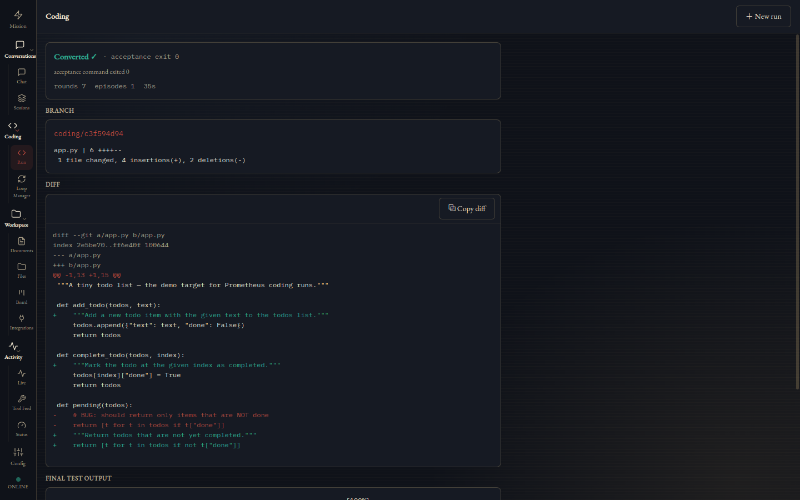
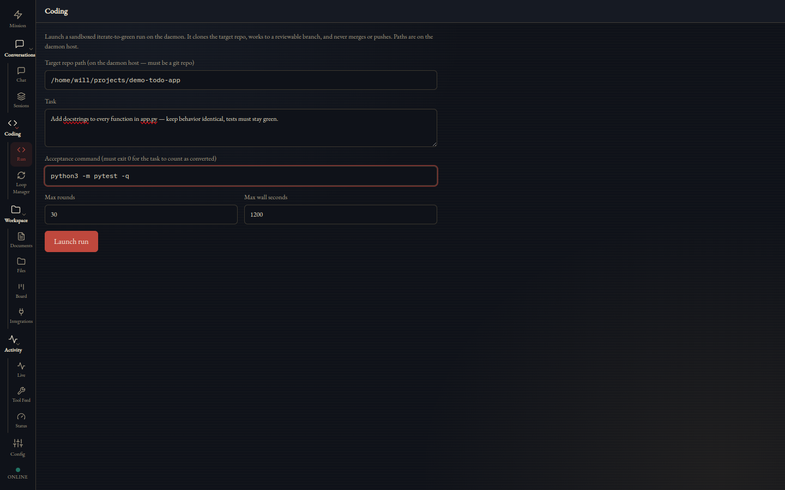
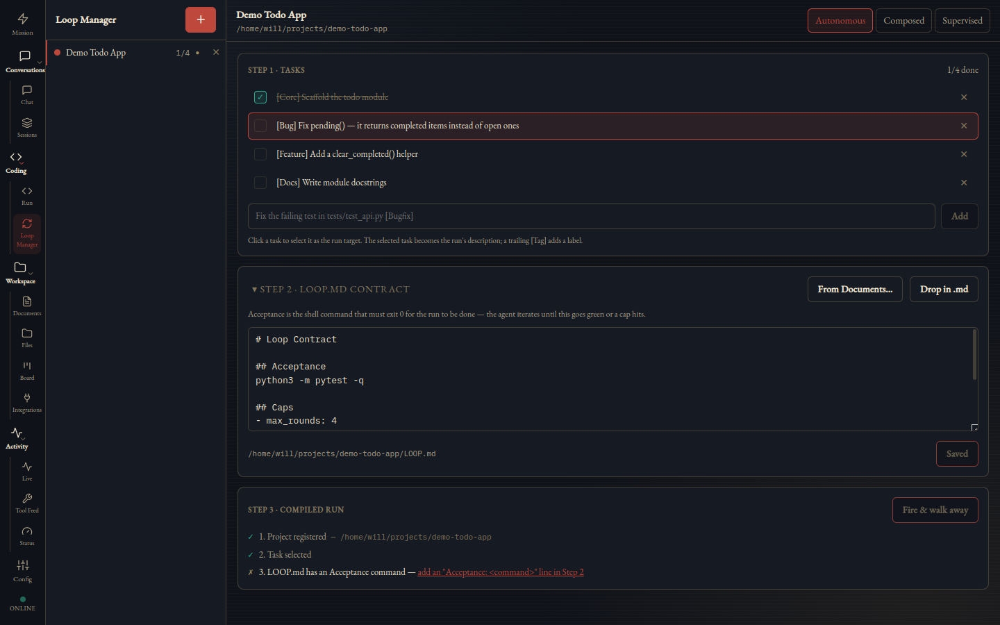
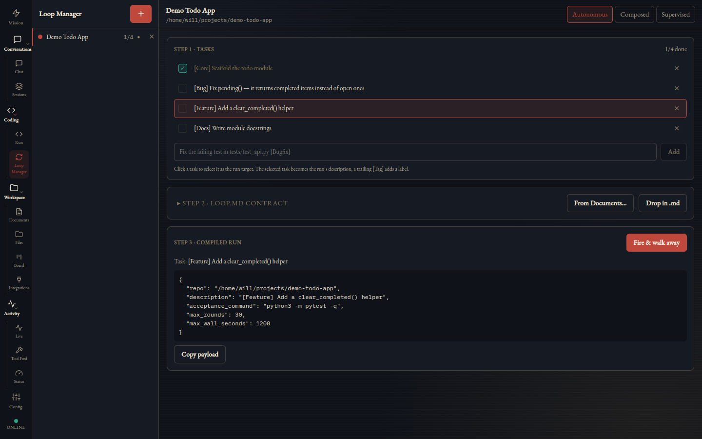
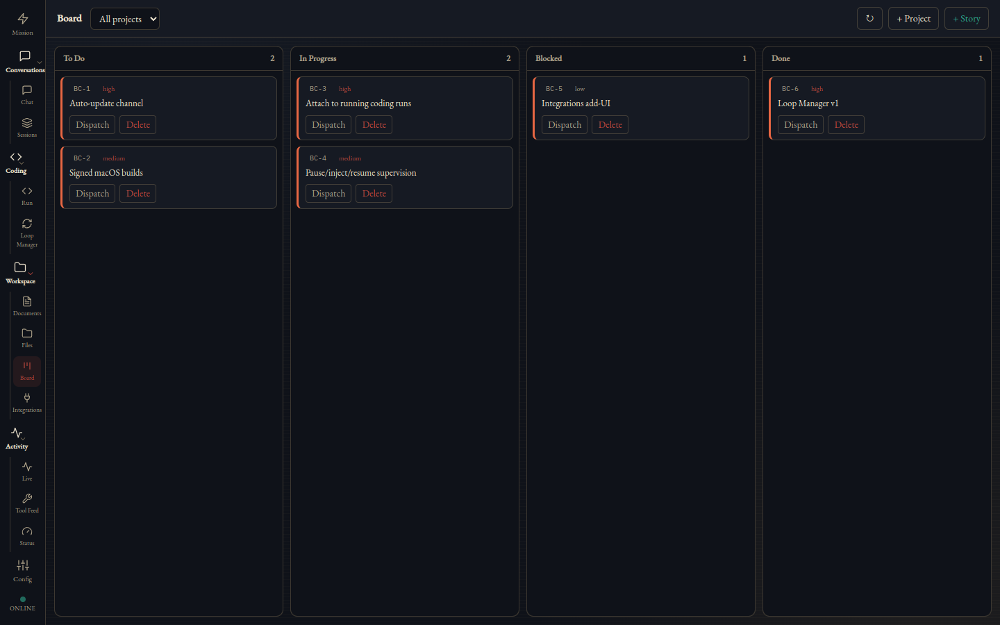
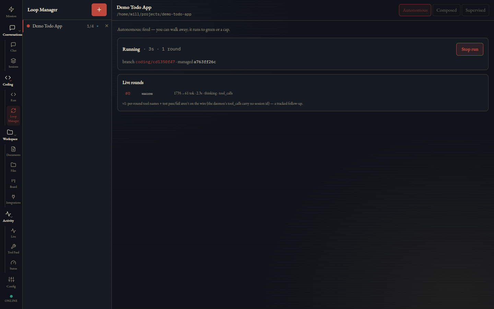
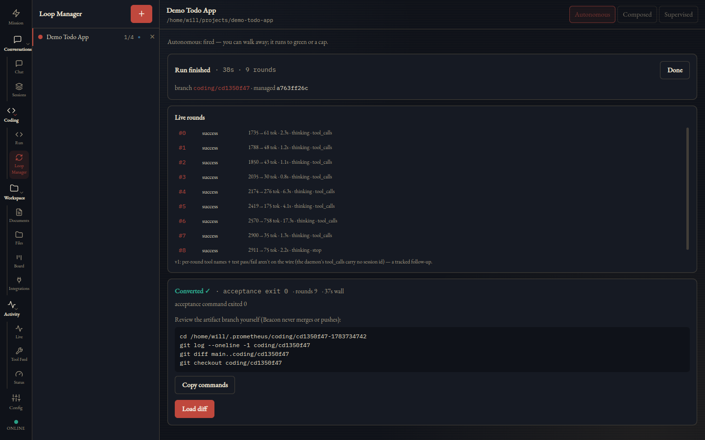

# Coding Mode & the Loop Manager

Prometheus Coding Mode is a sandboxed, autonomous "iterate-to-green" coding loop: you hand it a repository, a task in plain language, and an acceptance command, and it works in a disposable clone until that command exits 0 — or it runs out of budget and says so honestly. Beacon layers three surfaces on top: a **Run** panel for one-off runs, a **Loop Manager** cockpit for running a project as a sequence of tasks, and a **Kanban board** that can dispatch stories straight into runs. Every run ends the same way: a branch in a sandbox clone that you review with plain git. Nothing is ever merged or pushed on your behalf.

[← README](../../README.md)



## The philosophy: done is a verdict, not a claim

Most agent loops let the model decide when it is finished. Coding Mode does not. The `IterateToGreenPolicy` treats "done" as something the harness proves, not something the model asserts:

- **The session re-runs your acceptance command itself.** When the model claims the task is complete, Prometheus executes the acceptance command you supplied inside the sandbox and reads the exit code. Exit 0 is the only thing that counts as success.
- **No-evidence turns are rejected.** A turn where the model declares progress without actually running anything is bounced back — the loop demands evidence before it accepts a claim.
- **Repeated identical failures trigger a step back.** If the same failure shows up twice in a row, the policy forces the session to stop grinding on the same fix and reconsider its approach instead of burning rounds on a loop.

The result is a run report you can trust: `success` means your command passed in a clean clone, and anything else is labeled as the failure it is.

## How a run works

**The sandbox.** Every run gets a `ProcessSandbox`: a **full clone** of your repository in a dedicated directory (by default under `~/.prometheus/coding/`). Your working tree is never touched. Inside the sandbox:

- The working directory is **jailed** — file operations are confined to the clone, with symlink-resolving containment so a symlink can't escape the jail.
- The environment is **scrubbed** — provider API keys and other secrets never reach the subprocess that runs your code or tests.
- **Wall-clock and round caps** bound the run. The defaults are 30 model rounds and 1200 seconds; both are configurable.

**Episodes.** The session drives the agent loop in episodes — coherent stretches of work punctuated by seams where the harness checks in, evaluates evidence, and (if supervision is enabled) polls the control channel. Thinking is on by default for coding turns; it is the single highest-leverage setting for this workload.

**The artifact.** The output of a run is a **branch in the sandbox clone**, named `coding/<task-id>`. Prometheus **never merges and never pushes** — not from the CLI, not from Beacon. You review the branch with ordinary git:

```bash
cd <sandbox_root>            # printed in the run report
git log coding/<task-id>
git diff main...coding/<task-id>
```

If you like what you see, you fetch or cherry-pick it into your real repository yourself. If you don't, you delete the clone and nothing happened.

Each run is also registered as a durable managed task in `tasks.db` (vetted by the SecurityGate), so completion notifications reach Telegram and Beacon even if you close the window.

## Launching a run

### From the CLI

```bash
prometheus code \
  --repo /path/to/your/repo \
  --task "Add a --json flag to the export command" \
  --acceptance "uv run pytest tests/test_export.py"
```

Flags (all verified against the `prometheus code` subcommand):

| Flag | Required | Default | Meaning |
|---|---|---|---|
| `--repo` | yes | — | Path to the target git repository (cloned, never touched) |
| `--task` | yes | — | What to do, in plain language |
| `--acceptance` | yes | — | Command that must exit 0 for the task to count as done |
| `--task-id` | no | generated | Task id; names the branch `coding/<id>` |
| `--max-rounds` | no | 30 | Model-round cap across the whole run |
| `--max-wall-seconds` | no | 1200 | Wall-clock cap for the run |
| `--sandbox-parent` | no | `~/.prometheus/coding` | Where the dedicated clone lives |
| `--control-dir` | no | off | Per-run directory for the mid-run control file (pause/inject/resume); absent means the control channel is off |
| `--suppress-thinking` | no | off | Run with thinking suppressed (coding turns think by default) |

The command always prints a JSON report — including the `sandbox_root` where the clone and branch live — and the **exit code is the verdict**: 0 on success, 1 otherwise. Even an uncaught mid-run error produces a structured `failed_error` report rather than a bare crash.

### From Beacon's Run panel

The **Run** panel is the one-off launcher: repo path, task, acceptance command, max rounds, max wall seconds. Submitting posts to `POST /api/code` on the daemon.



### From the Loop Manager

The **Loop Manager** is Beacon's PM cockpit for running a whole project as a series of coding runs. You register local repositories (label, root path, color dot), and each project shows a live done/total task ratio plus idle/running/done status.

Each project gets a three-step launch workspace:



1. **TASKS.md board** — a parsed task list you can add to, toggle, delete, and tag with `[Tag]` labels. You pick the task the run will target, or create a board from a seed.
2. **LOOP.md contract editor** — the run contract: an `Acceptance: <command>` line, caps, and project conventions. You can generate a template, drop in an existing markdown file, or pull one **"From Documents…"** — browsing the daemon's documents library, which works even from a remote Beacon.
3. **Compiled run** — a preview of the exact payload, a live **readiness checklist** with jump-links to anything missing, and the **Fire** button.



Runs launch in one of **three modes**: **Autonomous** (fire and review the artifact), **Composed**, or **Supervised** (watch the live stream with a Stop button).

All Loop Manager file operations — reading and writing TASKS.md and LOOP.md — are routed through the daemon's `/api/project-file` endpoint rather than local disk, so a Beacon running on your laptop can drive loops on the daemon host.

### From the Kanban board

The Board panel manages projects and stories (`/api/projects`, `/api/stories`), and a story can be **dispatched** directly into a coding run (`/api/stories/.../dispatch`) — turning a card on the board into a sandboxed run without retyping the task.



## Watching it live

While a run is going, per-round telemetry streams over the daemon's authenticated WebSocket as `coding_round` events (with a final `coding_complete`). Each round carries its **outcome, tokens in → out, duration, thinking flag, and stop reason**; Beacon renders them as a live progression with an elapsed clock and a **Stop run** button.



Under the hood this is a tail on `telemetry.db` — rounds are committed incrementally as they finish, fanned out over the SignalBus to every connected Beacon.

## Reviewing the artifact

When the run terminates, Beacon shows the artifact review: a verdict card with the acceptance exit code, the branch name, a diff-stat, a colorized **diff viewer** (truncated at 256 KB for very large diffs), the final test output, and **copy-able git commands** for inspecting the branch locally.



This surface is deliberately **review-only**. Beacon gives you everything you need to evaluate the change and the exact commands to pull it in — but merging is a decision it will never make for you.

## Mid-run supervision

The daemon supports full mid-run supervision: **pause**, **inject** (feed guidance into the running session), and **resume**. The mechanism is a JSON control file that the session polls at episode seams — fail-safe by design, and completely dormant unless enabled, so an unsupervised run behaves byte-identically to one where supervision was never wired up.

Two ways to use it:

- **REST**, against a running run: `POST /api/code/{id}/pause`, `POST /api/code/{id}/inject`, `POST /api/code/{id}/resume` (plus `POST /api/code/{id}/stop` and `GET /api/code/{id}/diff`).
- **CLI**, by passing `--control-dir <dir>` to `prometheus code` and writing the control file into that directory.

One honest caveat: **Beacon's UI does not expose pause/inject yet.** Supervised mode in the Loop Manager currently means watching the live stream with a Stop button. The daemon capability is there and works over REST; surfacing pause/inject in Beacon is a roadmap item.

## Honest limits

- **The sandbox is process-level, not a container.** `ProcessSandbox` gives you a clone, a cwd jail, env-scrubbing, and time limits — but it is not OS-level isolation. `DockerSandbox` exists as an interface only and is unimplemented.
- **Live view is instance-local.** Beacon's live run view only shows runs launched from that Beacon instance. You cannot attach to a run started elsewhere (CLI, another Beacon), and relaunching Beacon mid-run loses the live view — the run itself keeps going, and the artifact is still there when it finishes.
- **Per-round detail is coarse.** Tool names and per-test pass/fail are not on the wire yet; you get round-level outcome, tokens, duration, and thinking flag.
- **Loop Manager is local-only.** Projects are local repository paths on the daemon host; there is no SSH or remote-host support in v1.
- **Supervised mode in Beacon = watch + Stop.** Pause/inject/resume are daemon-side only for now (see above).
