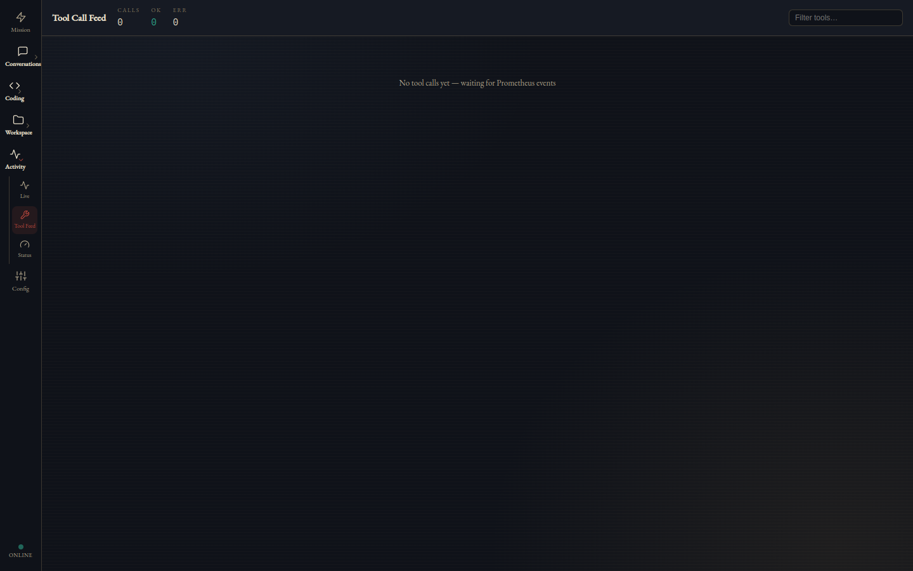

# Prometheus feature reference

This page is the complete map of what Prometheus can do: every entry point, tool, subsystem, interface, and command, with an honest note on what ships enabled and what is opt-in. Prometheus is a local-first AI agent daemon — one Python codebase that serves an interactive CLI, an always-on daemon, three chat gateways (Telegram, Slack, Discord), and an authenticated REST + WebSocket control plane consumed by the [Beacon desktop app](beacon.md). Every subsystem below carries a **Default: on/off** marker so you know exactly what runs out of the box; the [Honest status notes](#honest-status-notes) at the end collect the caveats in one place.

[← README](../../README.md)

---

## CLI & entry points

**Default: on** — these are the commands you run; nothing here is background behavior.

| Command / flag | What it does |
|---|---|
| `prometheus` (no args) | Interactive REPL chat against the configured model |
| `prometheus --once "QUERY"` | Run a single query non-interactively, then exit |
| `prometheus --voice` | Interactive mode with push-to-talk voice in and out |
| `--model` / `--provider` / `--config` / `--debug` | Per-run overrides |
| `--reset-telemetry` / `--reset-data` | Wipe the telemetry database, or all user data |
| `prometheus setup [--fast\|--noninteractive\|--gateway-only]` | First-run wizard: probes llama.cpp / Ollama / LM Studio / vLLM, generates your agent's identity, writes a working config, smoke-tests the loop, and mints the web API token |
| `prometheus daemon [--telegram-only]` | Start the always-on daemon: web API and WebSocket, gateways, cron, heartbeat, SENTINEL (if enabled), memory extractor |
| `prometheus doctor` | Diagnostics with one fix hint per failure; exits nonzero when anything is broken, so it works in scripts |
| `prometheus token show \| rotate` | Re-print the web API bearer token, or invalidate it and mint a new one |
| `prometheus install-service [--force]` | Write and enable a systemd **user** unit |
| `prometheus identity --show \| --regenerate` | Manage the SOUL.md / AGENTS.md identity files |
| `prometheus migrate --from hermes\|openclaw [--dry-run]` | Import config, identity, memory, and skills from `~/.hermes`, `~/.openclaw`, or `~/.clawdbot` |
| `prometheus code --repo --task --acceptance [...]` | Launch a sandboxed iterate-to-green coding run; `--control-dir` enables pause / inject / resume |
| `prometheus export-traces [--limit --output --tool]` | Export golden tool-call traces to JSONL for fine-tuning |

---

## Chat & models

### Providers — Default: local on, cloud dormant until keyed

Prometheus runs against local inference first: llama.cpp (with GBNF grammar-constrained decoding) and Ollama. The same harness also speaks to cloud providers — OpenAI, Google Gemini, xAI, DeepSeek, Kimi (Moonshot), GLM (Z.ai), and MiMo (Xiaomi) via the OpenAI-compatible protocol, plus native Anthropic. Cloud providers do nothing until you supply a key (in `~/.config/prometheus/env` or via Beacon's Models tab).

Two extras worth knowing about:

- **xAI subscription sign-in** — if you have a SuperGrok subscription, you can log in with an OAuth device flow instead of an API key. Prometheus prefers subscription credentials when both exist and reports which auth mode is active.
- **Credential rotation** — providers can hold multi-key pools with automatic dead-key cooldown, so one rate-limited key doesn't take the provider down.

### Model Adapter Layer — Default: on

The flagship feature: a validation layer between the agent loop and whatever model you run, built to make open models reliable in a tool loop. It validates every tool call before execution (with NONE / MEDIUM / STRICT strictness levels), repairs common errors automatically (fuzzy tool-name matching, JSON extraction from markdown fences and prose, type coercion), formats prompts per model family (Qwen, Gemma, Anthropic, generic), and when a call still fails, retries by feeding the specific schema error back to the model rather than a generic "try again." On llama.cpp, GBNF grammars enforce valid JSON at the token level. If you enable adaptive strictness, the layer tunes itself from telemetry — tightening for models that misbehave, relaxing for ones that don't.

### Model router — Default: off (per-chat overrides: on)

An optional router classifies tasks, follows fallback chains, and can escalate to cloud models. The router itself ships disabled. What is always on is the per-chat override system: `/claude`, `/gpt`, `/gemini`, `/xai`, `/deepseek`, `/kimi`, `/glm`, `/mimo` route the current chat through that provider, `/local` returns to your local model, and `/route` shows what is currently in effect.

### Search forcing (tool_choice) — Default: on (per call)

Every chat surface — API, WebSocket, CLI — accepts a per-call tool directive (`auto | none | required | {tool: X}`) that threads all the way down to grammar selection, so you can force the model to actually call a tool (Beacon exposes this as the 🔍 toggle). Useful when a model would rather guess than search.

### Agent loop — Default: on

The engine that drives everything: streaming deltas and tool events, a circuit breaker that stops a model repeating the same failing tool call, per-round token accounting on every model call, and an honesty check that catches the model promising "I'll notify you when it's done" without actually registering a background task.

---

## Builtin tools

**Default: on** — roughly 41 agent-callable tools register at startup (the exact count varies slightly with optional dependencies). Registration is fault-tolerant: a tool that fails to load is skipped and reported, not fatal. Every tool call is telemetered.

**File & shell:** `bash`, `read_file`, `write_file`, `edit_file`, `grep`, `glob`, `notebook_edit`

**Web & media:** `web_search`, `web_fetch`, `youtube_transcript`, `download_file`, `browser` (Playwright), `message` (send to Telegram/Slack), `tts` (Piper text-to-speech), `image_generate` (Pollinations free / ComfyUI local / WAN 2.5 paid), `video_generate` (Kling 3.0, paid), `dashboard` (serve a live HTML dashboard over your LAN or tailnet)

**Memory & knowledge:** `lcm_grep`, `lcm_expand`, `lcm_expand_query`, `lcm_describe`, `wiki_compile`, `wiki_query`, `wiki_lint`, `sentinel_status`, `audit_query`, the file-memory tool (MEMORY.md / USER.md), `todo_write`, `skill`, `anatomy`

**Automation & delegation:** `cron_create` / `cron_delete` / `cron_list` (with a natural-language schedule parser), `task_create` / `task_get` / `task_list` / `task_update` / `task_stop` / `task_output` (durable background tasks), `agent` (spawn a subagent), `ask_user`, `sessions_list` / `sessions_send` / `sessions_spawn`, `lsp` (seven code-intelligence actions)

**Symbiote (experimental, off by default):** `symbiote_scout` / `symbiote_harvest` / `symbiote_graft` / `symbiote_status`, plus a GitHub search tool

**Not agent-callable but present:** `vision_analyze` and `whisper_stt` are internal helpers used by the gateways, WebSocket uploads, and the voice CLI — the agent does not call them directly.

**Dynamic:** any connected MCP server contributes tools at runtime as `mcp__{server}__{tool}`.

---

## Coding Mode

**Default: on (runs only when you launch one).** Point Prometheus at a repository, a task, and an acceptance command; it clones the repo into a sandbox and works in episodes until the acceptance command exits 0. The defining property is that **"done" is a verdict, not a claim** — the session re-runs your acceptance command itself, rejects turns that claim progress without evidence, and steps back when it hits the same failure twice. The sandbox is process-level: full clone, working-directory jail, environment scrubbing (your provider keys never reach the subprocess), wall-clock and time limits. Every run registers as a durable managed task, streams its rounds live to Beacon, and supports mid-run supervision — pause, inject guidance, resume — when launched with a control directory. The artifact is always a branch in the clone: Coding Mode **never merges and never pushes**.

Note the sandbox is process-level containment, not a container — see [Honest status notes](#honest-status-notes). Full details, including Beacon's Loop Manager cockpit, are in the [Coding Mode guide](coding-mode.md).

---

## Memory & knowledge

**Default: on** (the whole stack below ships enabled). Covered in depth in the [memory guide](memory.md); the short version:

- **Lossless Context Management (LCM)** — every message persists to SQLite. When context fills, Tier 1 strips old tool-result bodies (free — the output was already acted on); Tier 2 batch-summarizes with the LLM. Summaries live in a DAG and any of them can be expanded back to the original on demand, with full-text search across your whole history.
- **Assembly-time compactor** — a relief valve that trims the prompt as it is assembled. Default: on.
- **File memory** — a bounded `MEMORY.md` (12K chars) and `USER.md` (8K chars) that ride every system prompt, readable and editable by you.
- **Memory extractor** — roughly every 30 minutes, mines your conversations into structured facts by entity category with confidence scores (machine-generated sessions are excluded).
- **Passive recall** — at the start of each turn, your message is matched against the memory store and the top facts (at most 6 facts / 900 chars, minimum 0.6 confidence) are injected as "Recalled memory." It fails open and applies to chat surfaces only. Default: on.
- **Wiki** — a compiler builds cross-linked markdown entity pages under `~/.prometheus/wiki/` from extracted facts. The output is Obsidian-compatible; an install script wires up the vault view.

---

## SENTINEL & the autonomous layers

These are the proactive subsystems that act while you are idle. They are the marquee features and also the most clearly **opt-in** — each one is a config flag away, and each is marked below.

- **SENTINEL observer** — **Default: off** (`sentinel.enabled: false`). Watches signal patterns and **nudges you via Telegram; it never auto-executes**. All SENTINEL activity flows through a persisted signal bus that Beacon also subscribes to.
- **AutoDream** — **Default: off** (part of SENTINEL). Idle-time "dreaming" in four phases: wiki lint → memory consolidation → telemetry digest → knowledge synthesis. The first three phases use **zero LLM calls**; only phase four calls the model, capped at a 2,000-token budget.
- **Curator** — **Default: on.** A weekly consolidation pass over the skill library: merges and archives, never hard-deletes, and never touches pinned skills. Inspect or trigger it with `/curator`.
- **GEPA** — **Default: off.** Evolutionary skill optimization: idle-time generation of skill variants judged by your local model. Controlled via `/gepa`.
- **Escalation to teacher** — **Default: off.** Deterministic failure detection hands the failing exchange to a stronger cloud model, which returns a corrective reply and a drafted skill file. Note: its `budget_usd` cost cap is declared but **not yet enforced** — see [Honest status notes](#honest-status-notes).
- **Symbiote** — **Default: off. Experimental.** A scout → harvest → graft self-modification pipeline that finds relevant open-source code on GitHub, adapts it, and hot-swaps it in via blue-green deployment with automatic rollback, backed by a backup vault and a license gate. Powerful and unstable; treat it as a research feature.

---

## Automation

- **Cron** — **Default: on** (runs inside the daemon). Schedule anything the agent can do, in plain English ("every weekday at 7am") or cron syntax, via chat commands, the `cron_*` tools, or the REST API. Failed jobs push a Telegram notification.
- **Durable tasks** — **Default: on.** Background tasks persist in a database and survive daemon restarts; completion fires an event that notifies you on Telegram and in Beacon.
- **Honesty check** — **Default: on.** If the model tells you it will do something later, the harness verifies a real task was actually registered; unfounded promises are caught rather than silently forgotten.
- **Daily briefing** — **Default: available, not scheduled.** A deterministic news + market + weather briefing job that delivers to Telegram and fails loudly rather than sending a partial briefing. It is the only shipped job; wire it to whatever cron schedule you want.
- **Heartbeat** — **Default: on** (with the daemon). Periodic health checks, task watching, and proactive pushes.

---

## Security & permissions

**Default: on** — the security gate is not optional and sits in front of every tool call.

- **Four-level trust model** (BLOCKED → APPROVE → AUTO → AUTONOMOUS), and it is **origin-aware**: things you ask for directly skip the exfiltration and network gates that background work (SENTINEL, cron, gym) must still pass. Your agent's autonomy is scoped to where the request came from.
- **Hard limits**: always-blocked command patterns, denied commands and paths, workspace boundary enforcement, bash intent analysis, and an `allowed_commands` regex allowlist that refuses shell-chaining metacharacters.
- **Exfiltration and prompt-injection defense** on outbound content. Default: on.
- **Audit log** — every gated decision lands in SQLite + JSONL, queryable from chat (`/audit`) or by the agent itself (`audit_query`). Default: on.
- **Approval queue** — **Default: off.** Human-in-the-loop mode: risky calls wait for `/approve` / `/deny` / `/pending` on Telegram or one-click cards in Beacon.
- **Secrets hygiene** — secrets live in `~/.config/prometheus/env`, never in the yaml; a pre-commit hook blocks secrets and network identifiers from landing in the repo.

---

## Interfaces

### Telegram — Default: off until you add a bot token

The most complete chat surface. Beyond text it handles inbound photos (vision captioning), voice notes (Whisper speech-to-text), documents in 20+ formats, and stickers. The full command surface:

`/start /clear /reset /status /help /model /route /wiki /note /sentinel /benchmark /context /skills /memory /curator /notifications /voice /health /events /steer /queue /unqueue /clearsteers /anatomy /doctor /profile /beacon /tools /pairs /approve /deny /pending /gepa /symbiote /audit /press /escalations` plus the provider overrides `/claude /gpt /gemini /xai /grok /deepseek /kimi /glm /mimo /local`.

The standouts: `/steer` injects a course-correction into a turn that is already running, `/queue` and `/unqueue` line up follow-up turns while the agent is busy, and the provider overrides switch a single chat to a cloud model and back. The full table with descriptions is in [Commands](#commands) below.

### Slack — Default: off until you add tokens

Socket Mode app with 23 `/prometheus-*` workspace slash commands, thread-based long replies, and channel whitelists. Optional install: `pip install 'oara-prometheus[slack]'`. Slack and Discord share Telegram's command layer, so behavior stays at parity.

### Discord — Default: off until you add a token

`/prometheus` app commands, always-on DMs plus guild/channel whitelists, and threaded long replies. Optional install: `pip install 'oara-prometheus[discord]'`.

### REST API — Default: on (bearer-token auth)

A FastAPI server (~60 routes) exposing everything: status, sessions and chat (with `tool_choice`), history, telemetry, repair pairs, config (redacted), skills with pin/unpin, profiles, wiki/LCM/SENTINEL views, event and activity feeds, memory files, cron CRUD, workspace files, the documents editor with AI redlines, approvals, benchmark runs, the model catalog, per-session model overrides, provider key management, xAI OAuth, coding runs with stop/pause/resume/inject and diffs, project files, and the Kanban board. `/health` is the one unauthenticated route. When no config exists yet, the daemon instead boots a setup-mode server whose only job is pairing (6-digit code → token) and first-run configuration. Full route reference in the [API guide](api.md).

### WebSocket bridge — Default: on (first-frame auth)

Real-time channel on :8010. The first frame must be `{"type": "auth", "token": ...}` or the connection is closed. Streams chat deltas, agent state, tool-call start/end events, and the signal-bus fan-out: SENTINEL signals, dream events, skill created/refined, memory updates, curator reports, and live coding-run rounds.

### Web chat (Beacon) — Default: on with the daemon

Beacon's chat rides the API and WebSocket above, with slash-command parity for formatting and session commands. **Parity limit:** mutating commands — `/route`, `/approve`, `/benchmark` and similar — currently work only on Telegram.

---

## Commands

The full Telegram command table. Slack (`/prometheus-*`) and Discord (`/prometheus`) expose the same command layer with platform-appropriate naming.

| Command | What it does |
|---|---|
| `/start` | Check if Prometheus is online |
| `/help` | List commands and capabilities |
| `/status` | Model, uptime, tools, memory, SENTINEL state, queues |
| `/model` | Current model name and provider |
| `/route` | Show this chat's routing (primary vs override) |
| `/context` | Context window usage |
| `/health` | Silent-failure telemetry for the last 24h, or e.g. `/health 168 verbose` |
| `/doctor` | Diagnostic health check against the model registry |
| `/anatomy` | Hardware, GPU, VRAM, infrastructure snapshot |
| `/profile` | Show or switch agent profiles |
| `/reset` / `/clear` | Clear conversation context |
| `/steer <text>` | Inject mid-turn guidance (arrives after the next tool call) |
| `/queue <text>` | Line up a follow-up turn for after the current one ends |
| `/unqueue` | Drop the most recently queued prompt |
| `/clearsteers` | Drop all pending steers without surfacing them |
| `/wiki` | Wiki stats and recent entries |
| `/note [@entity] <text>` | Save a manual fact to memory |
| `/memory` | Memory files: `show [user]` \| `limits` |
| `/skills` | Skills: `list` \| `show` \| `pin` \| `unpin` \| `history` |
| `/curator` | Curator: `status` \| `show` \| `run [dry]` |
| `/notifications` | Skill/memory/curator notifications: `off` \| `quiet` \| `verbose` |
| `/voice` | Voice replies: `auto` \| `on` \| `off` (auto mirrors your input modality) |
| `/events` | Recent signal-bus events: `recent` \| `skills` \| `memory` \| `curator` \| `show <id>` |
| `/sentinel` | SENTINEL subsystem status |
| `/benchmark` | Run a quick smoke test |
| `/tools` | Tool-call telemetry dashboard |
| `/pairs` | Repair-pair flywheel stats |
| `/approve` / `/deny` | Approve or deny a pending tool request |
| `/pending` | List pending approval requests |
| `/gepa` | GEPA skill evolution: `status` \| `run` \| `history` |
| `/symbiote` | Symbiote pipeline: `<problem>` \| `approve` \| `graft` \| `morph` \| `swap` \| `backup` \| `backups` \| `restore` \| `status` \| `abort` \| `history` |
| `/audit` | Capability audit: `show last` \| `run` \| `web` \| `<category>` |
| `/press` | Printing Press CLI library: `list` \| `search` \| `install` \| `installed` \| `update` |
| `/escalations` | Escalation engine status |
| `/beacon` | Web bridge / dashboard status |
| `/claude` `/gpt` `/gemini` `/xai` (`/grok`) `/deepseek` `/kimi` `/glm` `/mimo` | Route this chat through that cloud provider |
| `/local` | Clear the override, back to the primary model |

---

## Documents & Kanban

- **Documents editor** — **Default: on** (part of the web API). A confined documents folder with read/save/edit over the API; Beacon gives it a writing surface with auto-save. "Ask AI" produces **redline suggestions**: a single span-bounded model call (not an agent loop) returns find/replace/reason edits, each validated for uniqueness, and nothing touches disk until you accept.
- **Kanban board** — **Default: on.** Projects and stories in SQLite, drag-and-drop in Beacon, and stories can be dispatched directly into coding runs.

---

## Learning & fine-tuning gym

- **Skill creator** — **Default: on.** Turns successful multi-step traces (three or more tool calls) into markdown skill files the agent can reuse.
- **Skill refiner** — **Default: off.** Updates existing skills when better executions come along.
- **Nudge** — **Default: on.** Periodic self-reflection prompts.
- **Skills library** — the package ships **3** builtin skills (`commit`, `debug`, `plan`); your own directory at `~/.prometheus/skills/` holds auto-created and installed skills. The repo's 102-file `skills/` library is deliberately **not auto-loaded** — copy in what you want. See [Honest status notes](#honest-status-notes).
- **Pair capture** — **Default: on.** Adapter repairs and golden tool-call traces are captured and stored; browse with `/pairs`, export with `prometheus export-traces`.
- **Gym** — **Default: on-demand.** Runs frozen task-sets against live models with deterministic **dual scoring** (raw emission vs post-repair execution), refuses to declare winners below sample-size thresholds, and enforces one-variable-per-experiment via manifests.
- **Evals** — **Default: on-demand.** A local-LLM judge using constrained decoding (zero API cost), failure classification (model vs harness vs unclear), and trend tracking. Trigger with `/benchmark` or the REST API.
- **LoRA training** — **Roadmap.** DPO training and eval scripts exist, but the end-to-end flywheel currently ships only the data-collection half: capture → store → mine → export. Trajectory export is off by default.

---

## Extensibility

- **MCP** — **Default: on, zero servers configured.** Connect any MCP server (stdio, HTTP, or SSE transport); its tools appear at runtime as `mcp__{server}__{tool}` with collision-free naming.
- **LSP** — **Default: off.** Language servers spawned lazily by file extension give the agent real symbol definitions, references, and type errors; after every file edit, diagnostics feed back to the model in the same turn.
- **Subagents** — **Default: on.** The `agent` tool spawns subagents from a registry (see AGENTS.md below). The related divergence detector — checkpoint/rollback with goal-alignment scoring — is **off by default**.
- **Hooks** — **Default: on, empty.** A PreToolUse / PostToolUse pipeline with hot reload; a file-mutation verifier and the LSP diagnostics hook are the shipped examples.
- **Printing Press** — **Default: off.** Discovers and installs Go service CLIs into your skills directory on request (`/press`).

---

## Identity & profiles

**Default: on.** Identity is files you can read:

- **SOUL.md** — the agent's persistent identity, loaded into every prompt. Survives `/reset`. Generated at setup, no hardcoded names.
- **AGENTS.md** — the agent registry with specializations used for subagent spawning.
- **ANATOMY.md** — a live infrastructure snapshot: the AnatomyScanner scans CPU/RAM/GPU VRAM, the loaded model and its quantization, Tailscale peers, and disk, and renders Mermaid diagrams. Queryable via `/anatomy` or the `anatomy` tool, and it validates named project configs against available VRAM.
- **PROMETHEUS.md** — per-project agent instructions, the CLAUDE.md equivalent, picked up by the context assembler.
- **Agent profiles** — `full | coder | research | assistant | minimal`, switched with `/profile`, trading tool breadth for context budget.

---

## Observability

**Default: on**, except tracing.

- **Tool-call telemetry** — SQLite rows per model per tool: success rates, latency, circuit-breaker trips, lucky guesses, and adapter repairs. Surfaced in Beacon's Tool Feed, `/health`, `/tools`, and the REST API.
- **Token accounting** — every model call is wrapped in an envelope, so per-round token usage is tracked and silent failures surface instead of vanishing.
- **Tracing** — **Default: off.** Phoenix/OpenTelemetry integration, env-gated, compiled down to zero-cost no-ops when disabled.

---

## Configuration

One reference config (`config/prometheus.yaml.default`, ~19KB, heavily commented) documents every section:

`system, bootstrap, model, compaction, context, tools, adapter, security, infrastructure, gateway (telegram/slack/discord), whisper, model_router, router, slash_commands, divergence, learning (nudge/skill/curator/gepa), trajectory_export, symbiote, sentinel, memory.recall, web, image_generation, video_generation.kling, web_tools, printing_press, lsp, profiles, anatomy, mcp_servers, hooks, evals, tracing`

A separate `config/model_registry.yaml` carries per-model capability flags.

**Search order** for the active config:

1. an explicit `--config` path
2. `config/prometheus.yaml` — repo-local (checkout installs; gitignored)
3. `~/.prometheus/prometheus.yaml` (or `$PROMETHEUS_CONFIG_DIR/prometheus.yaml`)

Secrets never go in the yaml — they live in `~/.config/prometheus/env`, and any setting can be overridden with a `PROMETHEUS_*` environment variable.

---

## Honest status notes

These caveats are part of the reference, not fine print. If a claim elsewhere in the docs conflicts with this list, this list wins.

- **The skills library is not wired into the runtime.** The repo's `skills/` directory holds 102 authored skill files, but the loader does not load it — only the **3** package-bundled builtins (`commit`, `debug`, `plan`) plus whatever lands in your own `~/.prometheus/skills/` directory (which setup creates empty). The library is a copy-in-what-you-want resource, kept out of the prompt by design.
- **The fine-tuning flywheel is data-collection only.** Capture → store → mine → export ships and works; the actual LoRA training loop is roadmap, and trajectory export is off by default.
- **Many marquee subsystems ship off by default** and need a config flag: SENTINEL (including AutoDream), the model router, divergence detection, LSP, Symbiote, GEPA, escalation-to-teacher, skill refinement, the approval queue, Printing Press, tracing, Whisper voice input, and all three chat gateways.
- **Paid media backends are dormant until keyed.** WAN 2.5 image and Kling 3.0 video generation register as backends but never bill without keys, and the `auto` backend selector never picks a paid one.
- **DockerSandbox is unimplemented.** Coding Mode's sandbox is `ProcessSandbox` only: a full clone with a cwd jail, env scrubbing, and time limits — real containment at the process level, but not a container boundary. The source says so honestly; so do we.
- **Web chat lacks parity for mutating commands.** `/route`, `/approve`, `/benchmark`, and similar state-changing commands currently work only on Telegram; Beacon's web chat covers formatter and session commands.
- **The escalation cost cap is not enforced yet.** `budget_usd` in the escalation config is declared for future enforcement; today it does not stop spending.
- **Model IDs in the default config are forward-looking defaults,** not guarantees that a given provider still serves that exact model.
