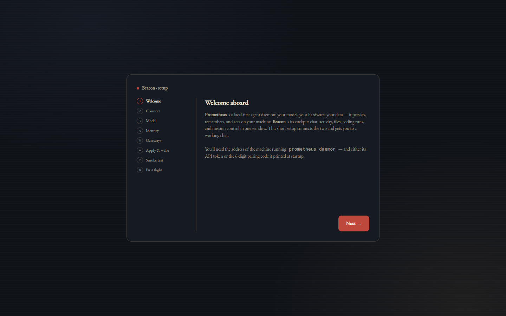
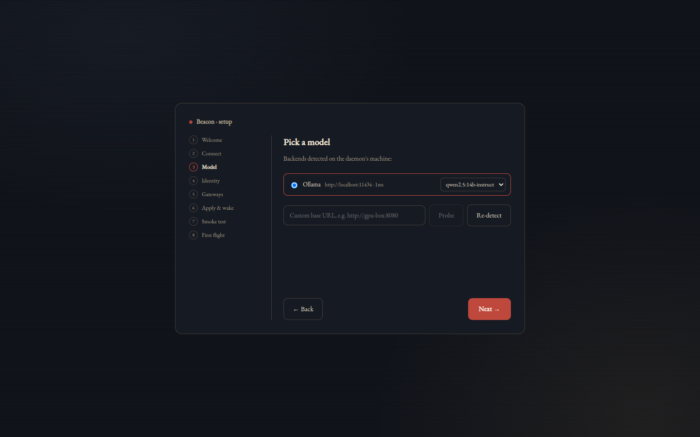
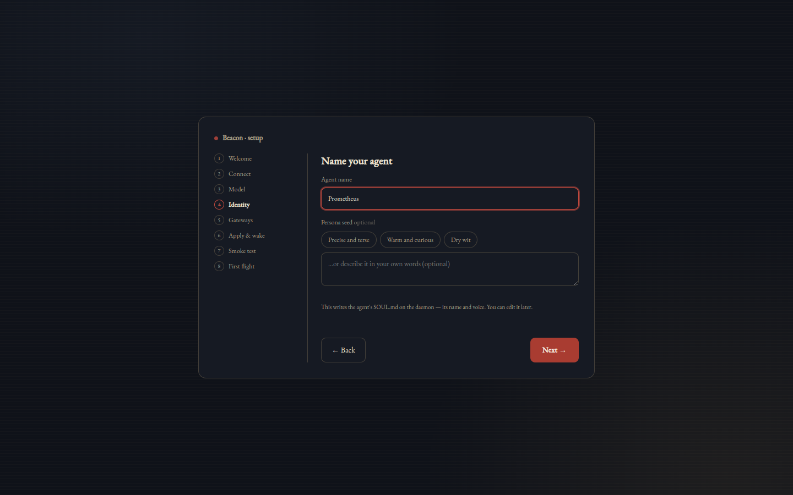
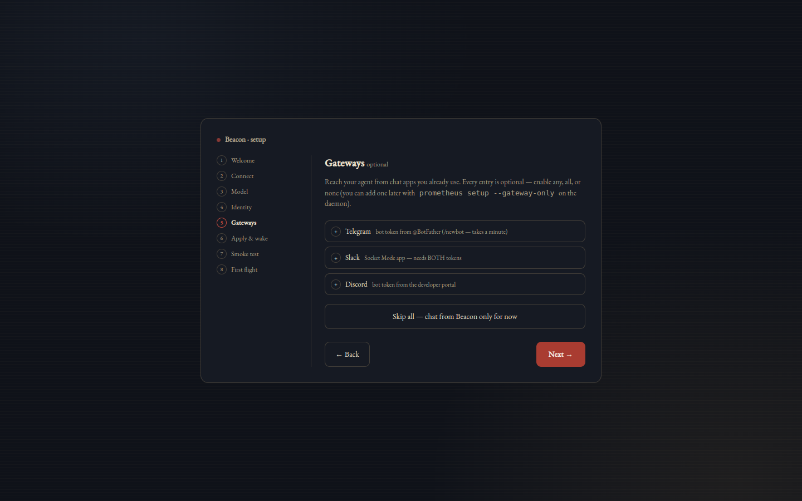
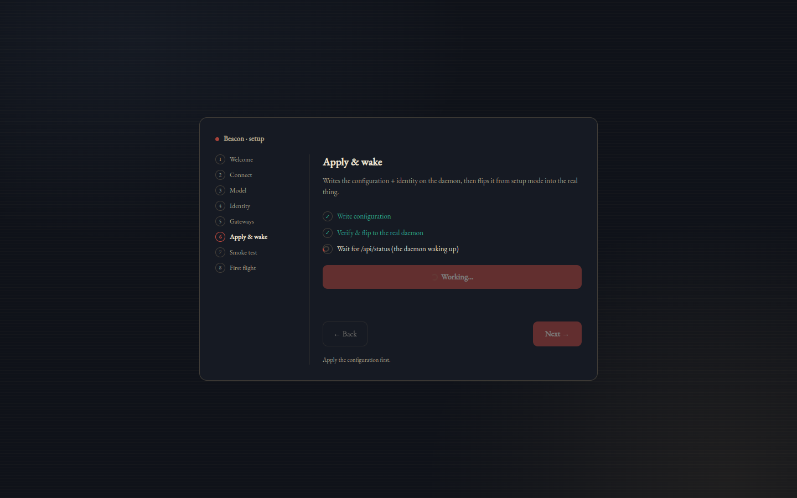
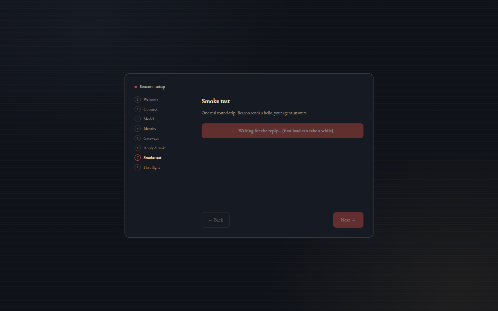
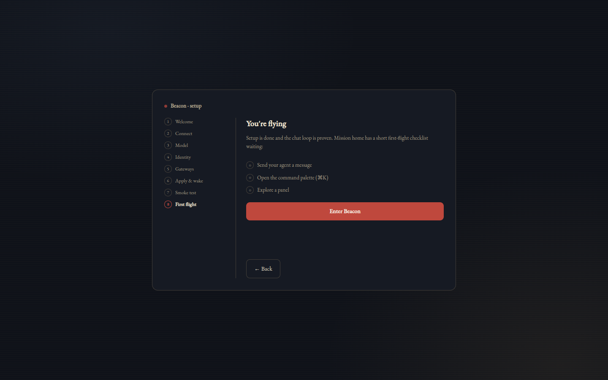

# Install & first flight

This page takes you from nothing to a running Prometheus daemon with Beacon connected — including the fully guided "couch mode" path, where the daemon boots into setup mode and Beacon's wizard does the rest. Every command here is copy-pasteable; where something is rough today (unsigned macOS builds, PyPI publish still pending), the page says so instead of pretending otherwise.

[← README](../../README.md)

## Prerequisites

- **Python 3.11+** on the machine that will run the daemon.
- **An inference backend** — llama.cpp or Ollama running with any model loaded (LM Studio and vLLM also work), *or* a cloud API key (OpenAI, Anthropic, Gemini, xAI, DeepSeek, Kimi, GLM, MiMo). The setup wizard probes for local servers and never writes a config it knows is broken.
- **Optional:** a Telegram bot token from [@BotFather](https://t.me/BotFather) if you want the Telegram gateway. The CLI and Beacon work without any gateway.

No GPU? Point Prometheus at a cloud provider and you still get the full harness — memory, wiki, security gate, coding runs, all of it.

## Install the daemon

The path that works for everyone today is a git checkout:

```bash
git clone https://github.com/OAraLabs/Prometheus.git && cd Prometheus
pip install -e '.[full]'
```

The `[full]` extra pulls in everything (web API, Slack/Discord gateways, MCP, browser, voice, evals). You can install leaner extras later — for example `pip install 'oara-prometheus[slack]'` adds just the Slack gateway.

> **Packaged install (pending).** `pip install 'oara-prometheus[full]'` is the intended one-liner. CI already builds sdist + wheel per tagged release, but PyPI publishing hasn't landed yet — until it does, use the git checkout above.

## Run setup

```bash
prometheus setup
```

The wizard detects your inference server (llama.cpp on `:8080`, Ollama on `:11434`, LM Studio on `:1234`, vLLM on `:8000`), generates your agent's identity (`SOUL.md`), writes a working config with the web API enabled, and smoke-tests the loop with one real round-trip. If no server is running it offers a remote URL, a cloud provider, or copy-paste install instructions.

Variants:

```bash
prometheus setup --fast            # quick path: probe local servers, write yaml + env — 3 questions
prometheus setup --noninteractive  # zero questions (implies --fast): first detected server, CLI gateway
prometheus setup --gateway-only    # add or change Telegram, Slack, or Discord later
```

Note that `--fast` skips identity generation and the smoke test — it's for when you just want a config on disk.

Then run it:

```bash
prometheus                # interactive CLI chat
prometheus daemon         # always-on: web API + gateways + cron + background layer
```

## The API token

On the **first** daemon start, Prometheus mints a secure `PROMETHEUS_API_TOKEN`, saves it to `~/.config/prometheus/env`, and prints it **once**. Everything that talks to the daemon's REST or WebSocket surface — including Beacon — presents this token.

```bash
prometheus token show     # re-print the current token
prometheus token rotate   # invalidate it and mint a new one
```

Quick sanity check that the API is up and authed:

```bash
curl -H "Authorization: Bearer $(prometheus token show | head -1)" http://localhost:8005/api/status
```

Secrets never go in the yaml config — they live in that env file, which both `prometheus daemon` and the systemd unit load.

## Run as a systemd service (Linux)

```bash
prometheus install-service          # writes ~/.config/systemd/user/prometheus.service
systemctl --user start prometheus
journalctl --user -u prometheus -f  # follow the logs
```

`install-service` also does the `daemon-reload` and `enable` for you. Useful flags: `--now` (start immediately after enabling), `--force` (overwrite an existing unit, backing it up first), and `--systemd-dir` to target a nonstandard directory.

## When something is off: `prometheus doctor`

```bash
prometheus doctor
```

Doctor checks every subsystem — config, backend reachability, token, gateways, service state — and prints a fix hint next to each failure:


The exit code is nonzero when anything is broken, so it also works in scripts and CI.

## Install Beacon

Beacon is the native desktop cockpit (macOS / Linux). Grab a prebuilt from [beacon-desktop releases](https://github.com/OAraLabs/beacon-desktop/releases) — no Node toolchain needed. (Releases are published from CI drafts, so the latest tag may occasionally lag a few days behind main.)

- **macOS (Apple Silicon)** — download `Beacon-<version>-arm64.dmg` and drag Beacon to Applications. The build is currently **unsigned**, so Gatekeeper will balk the first time: right-click the app → **Open** → **Open**, or clear the quarantine flag directly:

  ```bash
  xattr -dr com.apple.quarantine /Applications/Beacon.app
  ```

- **Linux (AppImage)** — universal, no install step:

  ```bash
  chmod +x Beacon-*.AppImage && ./Beacon-*.AppImage
  ```

- **Linux (deb)**:

  ```bash
  sudo apt install ./Beacon-<version>-amd64.deb
  ```

- **From source**:

  ```bash
  git clone https://github.com/OAraLabs/beacon-desktop.git && cd beacon-desktop
  npm install && npm run dev
  ```

## The guided install (couch mode)

You don't have to run `prometheus setup` in a terminal at all. If you start the daemon with **no config**, it boots into **setup mode** — a pairing-only API that prints a one-time 6-digit code and waits for Beacon to drive the rest:

```bash
prometheus daemon
```


From here, everything happens in Beacon's 8-step wizard. Walkthrough, step by step:

### 1. Welcome

First launch opens the wizard. It sets expectations for the flow ahead — connect, pick a model, name your agent, gateways, apply, verify.



### 2. Connect (pairing)

Enter the daemon's address and the 6-digit code from the banner. Already have an API token (from an existing install)? The escape hatch takes `address + token` directly instead. The **Test** button probes the daemon before anything is saved and tells you exactly which state you're in: *unreachable*, *auth rejected*, *connected*, or *setup mode*.


### 3. Model

The wizard asks the daemon to probe for inference servers on its own host — llama.cpp `:8080`, Ollama `:11434`, LM Studio `:1234`, vLLM `:8000` — and shows what it found. Your model server can live anywhere the daemon can reach; there's a custom base URL field with its own **Probe** button for remote or nonstandard setups.



### 4. Identity

Name your agent and give it a persona seed. This generates `SOUL.md` — the persistent identity that rides every prompt and survives `/reset`. No hardcoded names anywhere.



### 5. Gateways

Optionally wire up Telegram, Slack, or Discord. All three are genuinely optional — **"Skip all" is a perfectly good answer**, and `prometheus setup --gateway-only` can add any of them later.



### 6. Apply & wake

The wizard writes the config and the daemon **wakes fully configured in the same process** — no restart, no re-pairing. Setup mode ends and the real API comes up.



### 7. Smoke test

One real chat round-trip through the whole stack — Beacon → daemon → model → back — so you know the loop actually works before you're done.



### 8. First flight

A short checklist of things to try first — your launch pad into the app.



And you land on Mission home, connected to your freshly installed daemon:


## Remote access over Tailscale

The daemon doesn't have to be on the same machine as Beacon. If both are on your tailnet, pair Beacon to `<tailnet-hostname>` (or the Tailscale IP) instead of `localhost` — the ports are fixed at `:8005` for REST and `:8010` for WebSocket, so the address is all you type. The same works over a LAN, WireGuard, or anything else that routes.

Nothing but the daemon's address and the token leave your machine, and the token is stored in the OS keychain — it never reaches Beacon's renderer process again after you save it.

## Troubleshooting

- **Something's broken and you don't know what** — `prometheus doctor`. It checks every subsystem and prints a fix hint per failure; nonzero exit when anything fails.
- **Lost the API token** — it was only printed once, but `prometheus token show` re-prints it any time. `prometheus token rotate` if you think it leaked. It lives in `~/.config/prometheus/env`.
- **macOS refuses to open Beacon** — the build is unsigned. Right-click → **Open** → **Open** once, or `xattr -dr com.apple.quarantine /Applications/Beacon.app`.
- **Pairing code rejected or expired** — codes are strict by design: each one lives **15 minutes**, pairs **one client**, and allows **5 wrong attempts** before locking. Restart the daemon (`prometheus daemon`) to mint a fresh code and try again. Only a wrong code burns an attempt.
- **Beacon connects but shows auth errors** — the token Beacon stored no longer matches the daemon's (e.g. after a rotate). Open Connection Settings (`⌘,`), paste the output of `prometheus token show`, and hit **Test**.

Next: the [feature reference](features.md) for what everything does, or the [Beacon guide](beacon.md) for a tour of the app you just installed.
