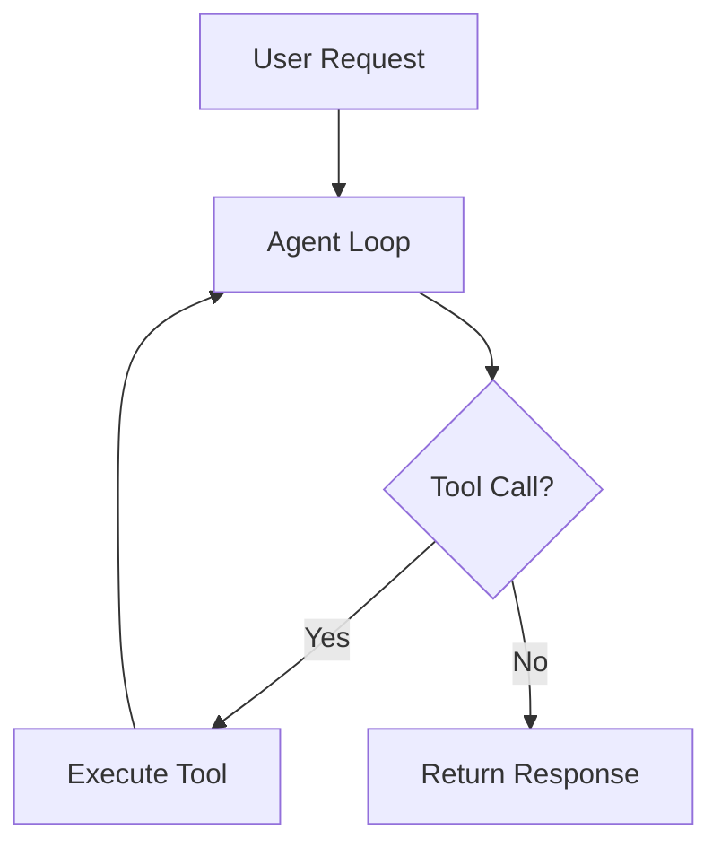

# Diagram Design Methodology

Design diagrams by planning element layout, relationships, and visual hierarchy. This skill covers the conceptual design process and can output in multiple formats: Mermaid syntax, ASCII art, SVG via Python, or structured data for external renderers.

## Workflow

1. **Understand the system** - Read relevant code/docs to understand what needs diagramming
2. **Plan the layout** - Determine elements, relationships, and visual hierarchy
3. **Choose output format** - Mermaid (for markdown), ASCII (for terminal), SVG (for files), or JSON
4. **Generate the diagram** - Create the output file

## Output Formats

### Mermaid (Recommended for docs)

Write Mermaid syntax to a .md file using `file_write`:

```markdown

```

### ASCII Art (For terminal/logs)

Generate text-based diagrams for inline display:

```
+------------------+     +------------------+
|   User Request   |---->|   Agent Loop     |
+------------------+     +--------+---------+
                                  |
                         +--------v---------+
                         |   Tool Call?     |
                         +--------+---------+
                          Yes |         | No
                    +---------v--+  +---v-----------+
                    | Execute    |  | Return        |
                    | Tool       |  | Response      |
                    +------------+  +---------------+
```

### SVG via Python

Use `bash` with Python for more complex diagrams:

```bash
python3 -c "
import svgwrite
dwg = svgwrite.Drawing('diagram.svg', size=('800px', '600px'))
# ... add elements
dwg.save()
"
```

---

## Element Design Reference

### Sizing Guidelines

**Text sizes:**
- Minimum body text: 14-16px
- Titles and headings: 20px+
- Secondary annotations: 12-14px (sparingly)

**Element sizes:**
- Minimum shape size: 120x60 for labeled boxes
- Leave 20-30px gaps between elements minimum
- Prefer fewer, larger elements over many tiny ones

### Color Palette

| Use | Color | Hex |
|-----|-------|-----|
| Primary / Input | Light Blue | `#a5d8ff` |
| Success / Output | Light Green | `#b2f2bb` |
| Warning / External | Light Orange | `#ffd8a8` |
| Processing / Special | Light Purple | `#d0bfff` |
| Error / Critical | Light Red | `#ffc9c9` |
| Notes / Decisions | Light Yellow | `#fff3bf` |
| Storage / Data | Light Teal | `#c3fae8` |

### Layout Principles

**Flow direction:**
- Top-to-bottom for sequential processes
- Left-to-right for data flow / pipelines
- Radial for hub-and-spoke architectures

**Grouping:**
- Use background zones/containers to group related components
- Align elements to an implicit grid
- Keep crossing lines to a minimum

**Hierarchy:**
- Largest/darkest elements = most important
- Use color intensity to show importance
- Primary flow should be the most visually prominent path

### Connection Types

| Type | Use For | Mermaid | ASCII |
|------|---------|---------|-------|
| Solid arrow | Direct dependency/flow | `-->` | `-->` |
| Dashed arrow | Optional/async | `-.->` | `- ->` |
| Thick arrow | Primary flow | `==>` | `==>` |
| Dotted line | Weak association | `...` | `....` |

## Diagram Types

### Architecture Diagram
- Show system boundaries clearly
- Group by deployment unit (container, service, host)
- Show external systems differently (dashed borders)
- Label all connections with protocol/method

### Flowchart
- One entry point, clear exit points
- Decision diamonds with labeled branches (Yes/No, True/False)
- Keep branches balanced visually
- Max 15-20 nodes before splitting into sub-diagrams

### Sequence Diagram
- Participants ordered by first interaction (left to right)
- Use activation bars for processing time
- Group related messages with boxes/notes
- Show error paths with different line styles

### Entity Relationship
- Primary keys marked clearly
- Relationship cardinality on both ends
- Group related entities spatially
- Use color to distinguish entity types

## Tips

- Use color consistently across the diagram
- Text contrast is critical - never use light gray on white backgrounds
- Do NOT use emoji in technical diagrams
- Keep labels concise - full descriptions go in accompanying text
- For complex systems, create multiple focused diagrams rather than one giant one

## Prometheus Context

- Use `file_write` to save diagram files (.md with Mermaid, .svg, .txt for ASCII)
- Use `bash` with Python for SVG generation
- Use `file_read` to examine code/config files that need diagramming
- Use `grep` to find system relationships and dependencies
- Store diagram design decisions in LCM for future reference
